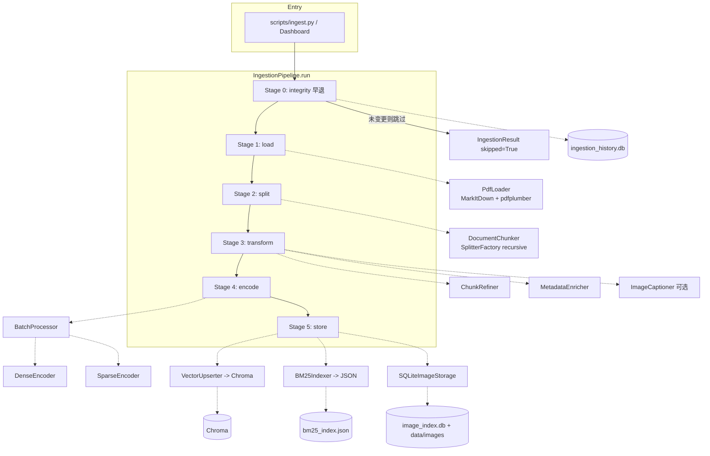
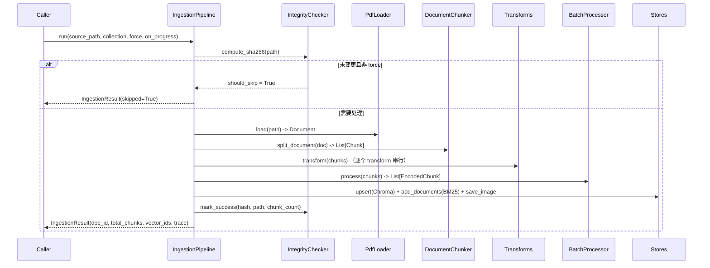
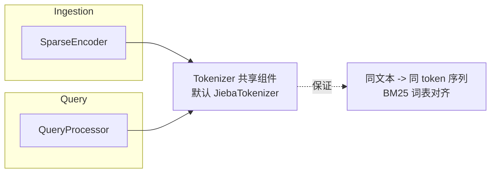

# 设计文档：Ingestion Pipeline MVP（流程梳理）

## Overview

Ingestion Pipeline 是本 RAG + MCP 教学项目（DEV_SPEC 阶段 C，任务 C1–C15）的离线摄取链路：把一个源文件（当前为 PDF）端到端地转换为可检索的向量与倒排索引，并持久化到本地存储（Chroma / BM25 JSON / SQLite）。整条链路由 `IngestionPipeline` 串行编排，分为六个阶段：`integrity → load → split → transform → encode → store`。

本设计文档如实记录当前已实现（as-built）的架构：组件职责、数据契约、关键算法与各阶段交互，作为后续功能完善、维护和讲解的权威参考。文中所有代码示例使用项目实际语言 **Python**。

> 说明：本文档聚焦于"功能流程梳理"。性能/成本类优化（如 BM25 增量更新、Embedding 差量计算、LLM 并发等）在当前 demo 阶段暂不纳入范围，留待后续迭代。

## Architecture



整套架构遵循项目的两条原则：**可插拔**（`Base*` 抽象接口 + `*Factory` 工厂）与 **Local-First**（SQLite + 本地 Chroma + JSON 索引）。所有组件均通过构造函数注入，`IngestionPipeline.from_settings(settings, **overrides)` 是真实装配入口，测试时可用 `overrides` 替换任意组件。

当 LLM 不可用时，`from_settings` 捕获异常并将 `llm=None` 传给 transforms，使其退化为"纯规则"模式（rule-only），不阻塞摄取。

## 主流程时序图



每个阶段都被 `TraceContext.start_stage / end_stage` 包裹以记录可观测信息；任一阶段抛错都会被包装成 `IngestionError`，并在 `integrity` 已计算出哈希时调用 `mark_failed` 记录失败。`on_progress(stage_name, current, total)` 回调按阶段触发，供 Dashboard 显示进度。

## Components and Interfaces

### IngestionPipeline（编排器，`src/ingestion/pipeline.py`）

**职责**：串行驱动六阶段；管理 trace；统一异常；触发进度回调；写入 integrity 历史。

**关键接口**：

```python
def run(
    self,
    source_path: str,
    collection: str = "default",
    force: bool = False,
    on_progress: ProgressCallback | None = None,
) -> IngestionResult: ...

@classmethod
def from_settings(cls, settings: "Settings", **overrides: Any) -> "IngestionPipeline": ...
```

**注入组件**：`loader, chunker, transforms[], batch_processor, vector_upserter, bm25_indexer, integrity_checker?, image_storage?`

### PdfLoader（`src/libs/loader/pdf_loader.py`）

**职责**：PDF → Markdown（MarkItDown）；图片提取（pdfplumber：按 bbox 裁剪 + 150 DPI 渲染 → PNG，存于 `data/images/{doc_hash}/`）；在文本中插入 `[IMAGE: {id}]` 占位符；填充 `metadata.images`。

**关键点**：`doc_id = f"pdf_{doc_hash[:12]}"`；占位符**追加在文本末尾**并按页分组（因 MarkItDown 丢失图片内联位置）；pdfplumber 缺失或提取失败时优雅降级（返回空图片列表，不阻塞）。

### DocumentChunker（`src/ingestion/chunking/document_chunker.py`）

**职责**：`SplitterFactory`（recursive）之上的业务适配层。生成确定性 `chunk_id = {doc_id}_{index:04d}_{hash8}`；继承文档元数据（剔除 `images`）；扫描 `[IMAGE: id]` 占位符把图片子集分发到对应 chunk 的 `image_refs` / `images`；设置 `source_ref`。

### Transforms（`src/ingestion/transform/`，统一实现 `BaseTransform`）

所有 transform 实现 `transform(chunks, trace) -> chunks` 与 `name` 属性，**逐 chunk 失败隔离**，绝不阻塞摄取。

- **ChunkRefiner**：始终执行规则去噪（正则：页眉页脚 / 分隔线 / HTML 注释与标签 / 空白规范化，且保护代码块），随后可选 LLM 重写（失败回退规则结果）。`metadata.refined_by ∈ {llm, rule, none}`。<30 字符的 chunk 跳过 LLM；LLM 输出为空或不足原文 20% 长度时判为无效并回退。
- **MetadataEnricher**：始终生成规则基线（标题取首个 heading/首行；摘要取前 1–2 句；标签按词频去停用词），可选 LLM 以 JSON 形式产出 title/summary/tags（带解析校验 + 回退）。`metadata.enriched_by`。
- **ImageCaptioner**：可选 Vision-LLM 对 chunk 图片逐张生成描述，把 `[IMAGE CAPTION {id}]: ...` 缝合进 `chunk.text` 及 `metadata.image_captions`；禁用/失败时标记 `has_unprocessed_images=True`。**仅当 `vision_llm` 配置存在时启用**（`from_settings` 当前默认 transforms 列表里不含它，除非显式配置）。

### Embedding（双路编码，`src/ingestion/embedding/`）

- **DenseEncoder**：包装 `BaseEmbedding`，内部 `batch_size=32` 再分批，严格校验返回数量与维度（数量不匹配抛 `RuntimeError`）。
- **SparseEncoder**：分词（ASCII 词长≥2 + 单个 CJK 字符）、去停用词，输出每 chunk 的 `SparseVector(chunk_id, term_freqs, doc_length)`。**刻意不计算 IDF**（语料全局量交给 indexer）。
- **BatchProcessor**：把 chunks 切成 `batch_size=32` 的批，每批同时驱动 dense 与 sparse，记录 `batch_timings`，返回保序的 `EncodedChunk(chunk, dense_vector, sparse_vector)`。

### Storage（`src/ingestion/storage/`）

- **VectorUpserter**：用 `chunk.id` 作为向量存储 id（确定性、内容派生），使向量库与 BM25 共享同一 id 空间（代码注释指出：早先的独立哈希方案曾破坏稀疏检索）。构建 `VectorRecord(id, vector, text, metadata)` 幂等 upsert。
- **BM25Indexer**：从 `SparseVector` 流构建倒排索引，计算 IDF（BM25 Robertson，`+1` 平滑保证非负），原子写入（tmp + replace）到 `data/db/bm25/bm25_index.json`。提供 `build / add_documents / remove_document / save / load / query(k1=1.5, b=0.75)`。
- **SQLiteImageStorage**：图片存于 `data/images/{collection}/`，SQLite 索引 `data/db/image_index.db`（`image_id → path, collection, doc_hash, page_num`，WAL 模式）。

### SQLiteIntegrityChecker（`src/libs/loader/file_integrity.py`）

**职责**：SHA256 去重。表 `ingestion_history(file_hash PK, file_path, file_size, status CHECK(success|failed|processing), processed_at, error_msg, chunk_count)`，WAL 模式。`should_skip` 仅当存在 `status='success'` 记录时返回 True。

### DocumentManager（`src/ingestion/document_manager.py`）

**职责**：跨 4 个存储（Chroma / BM25 / ImageStorage / FileIntegrity）协调文档生命周期：`list_documents / get_document_detail / delete_document / get_collection_stats`，供 Dashboard 使用。

## Data Models

来自 `src/core/types.py`，全链路共享契约，均带 `to_dict / from_dict`：

```python
@dataclass
class ImageRef:
    id: str
    path: str = ""
    page: int = 0
    text_offset: int = 0
    text_length: int = 0
    position: dict[str, Any] = field(default_factory=dict)

@dataclass
class Document:
    id: str
    text: str                              # 规范化 Markdown
    metadata: dict[str, Any]               # 至少含 source_path；含 doc_hash, images[]
    # @property images -> list[ImageRef]

@dataclass
class Chunk:
    id: str                                # {doc_id}_{index:04d}_{hash8}
    text: str
    metadata: dict[str, Any]               # 继承文档 + chunk_index/image_refs/title/...
    start_offset: int = 0
    end_offset: int = 0
    source_ref: str = ""                   # 指回 Document.id

@dataclass
class ChunkRecord:                          # 编码后存储载体
    id: str
    text: str
    metadata: dict[str, Any]
    dense_vector: list[float]
    sparse_vector: dict[str, float]

@dataclass
class RetrievalResult:
    chunk_id: str
    score: float = 0.0
    text: str = ""
    metadata: dict[str, Any] = field(default_factory=dict)
```

运行时编码阶段还使用两个本地结构：`SparseVector(chunk_id, term_freqs, doc_length)`（sparse_encoder）与 `EncodedChunk(chunk, dense_vector, sparse_vector)`（batch_processor）。

**BM25 索引序列化结构**（`bm25_index.json`）：

```python
{
  "N": int, "avgdl": float, "k1": 1.5, "b": 0.75,
  "doc_lengths": {chunk_id: int},
  "index": { term: {"idf": float, "postings": [[chunk_id, tf], ...]} }
}
```

## 关键算法（As-Built，含前置/后置条件）

### IngestionPipeline.run —— 串行编排 + 早退

```python
# 前置：source_path 指向存在的文件；collection 为目标集合名
# 后置：返回 IngestionResult；成功则写入 integrity success 记录；
#       失败抛 IngestionError 且（若已算出 hash）写入 failed 记录
def run(source_path, collection="default", force=False, on_progress=None):
    file_hash = integrity.compute_sha256(source_path)        # Stage 0
    if not force and integrity.should_skip(file_hash):
        return IngestionResult(skipped=True)                  # 零成本早退
    document = loader.load(source_path)                       # Stage 1
    chunks = chunker.split_document(document)                 # Stage 2
    for t in transforms:                                      # Stage 3（串行）
        chunks = t.transform(chunks, trace)
    encoded = batch.process(chunks, trace)                    # Stage 4
    for c in encoded.chunks: c.metadata["collection"] = collection
    vector_ids = upserter.upsert(...)                         # Stage 5a
    bm25.add_documents(sparse_vectors); bm25.save()           # Stage 5b
    store_images(document, collection)                        # Stage 5c
    integrity.mark_success(file_hash, source_path, total_chunks)
    return IngestionResult(...)
```

**不变量**：`encoded[i].chunk` 与输入 `chunks[i]` 顺序一致；`vector_id == chunk.id`，保证 Chroma 与 BM25 同 id 空间。

### BM25 IDF 与查询

```python
# IDF（非负，Lucene 变体）
def _compute_idf(df, n): return log((n - df + 0.5) / (df + 0.5) + 1.0)

# 查询打分（k1=1.5, b=0.75）
# score(q, d) = Σ_t idf(t) * (tf * (k1+1)) / (tf + k1*(1 - b + b*dl/avgdl))
```

## Error Handling

| 场景 | 当前行为 | 恢复方式 |
|------|---------|---------|
| integrity 计算失败 | 抛 `IngestionError`，不记录历史 | 调用方重试 |
| load/split/encode/store 失败 | 包装为 `IngestionError`；`mark_failed(hash)` | 修复后重新摄取（force 或删除记录） |
| 单个 transform 抛错（阶段级） | 阶段失败 → `IngestionError` | —— |
| 单 chunk transform 失败 | **隔离**，保留原 chunk + 标记 `*_error` | 不阻塞，后续可增量补处理 |
| LLM 不可用 | transforms 退化为 rule-only | 配置好 LLM 后重摄取 |
| pdfplumber 缺失 / 图片提取失败 | 跳过图片，仅处理文本 | 安装依赖后重摄取 |
| Vision-LLM 缺失 | 标记 `has_unprocessed_images=True` | 后续增量补描述 |

## Testing Strategy

- **单元测试**：各组件（chunker id 确定性、sparse 分词、bm25 roundtrip 与 IDF、upserter 长度校验、image_storage CRUD、integrity 去重）。
- **集成测试**：`tests/integration/test_ingestion_pipeline.py` 用 sample PDF 跑通端到端，断言 chunk 数、vector_ids、skipped 行为。

## Correctness Properties

以下属性建议在测试中固化（property-based / 单元）：

Property 1: id 确定性 —— 相同 `(doc_id, index, text)` 必然生成相同 `chunk_id`。

Property 2: 编码保序 —— `∀ i, batch.process(chunks)[i].chunk is chunks[i]`，编码不改变顺序。

Property 3: id 空间一致 —— `∀ chunk, VectorUpserter.make_vector_id(chunk) == chunk.id`，向量库与 BM25 共享 id。

Property 4: 幂等性 —— 同一文件二次摄取（非 force）得到 `skipped=True`；force 摄取时向量被同 id 覆盖，chunk 数不变。

Property 5: BM25 往返 —— `build → save → load` 后，对同一查询返回相同的 top-k 结果。

Property 6: IDF 非负 —— `∀ term, get_idf(term) >= 0`。

Property 7: 降级不阻塞 —— LLM / Vision / pdfplumber 缺失时，`run` 仍返回成功的 `IngestionResult`。

## Dependencies

MarkItDown（PDF→MD）、pdfplumber（图片提取，可选）、Chroma（向量库）、LangChain RecursiveCharacterTextSplitter（切分）、SQLite（stdlib）、OpenAI 兼容 Embedding（text-embedding-3-small）、可选 LLM / Azure Vision LLM。

---

# 本轮功能完善设计（多格式 Loader + 中文/Token 友好切分 + 表格感知 + jieba 分词）

> 本节是在上述 as-built 流程之上的**功能增量设计**，目标是补齐格式覆盖与中文检索质量，不引入性能/成本类优化。各改动相对独立，可分别落地。

## 目标与范围

1. **多格式 Loader**：在 PDF 之外新增 Markdown / docx / xlsx 三种格式，统一输出"规范化 Markdown 的 `Document`"契约。
2. **切分增强（默认递归 + CJK + Token 度量）**：增强 `RecursiveSplitter`，使其具备结构感知与 CJK 感知；切分大小度量从"字符"改为可插拔的**长度函数**，默认按 **token**（tiktoken，对齐 embedding 模型）计量；`chunk_size / chunk_overlap` 接入配置并支持**按 collection 覆盖**。
3. **表格感知切分（按 doc_type 路由）**：在默认递归之上，为 `xlsx`（Markdown 表格）增加专用 `TableAwareSplitter`，由 `DocumentChunker` 按 `doc_type` 路由。这是方案 B 的最小落地（仅表格一套专用策略 + 路由层），其余格式仍走默认递归。
4. **结构化切分 metadata（支持按结构过滤）**：升级 splitter↔chunker 契约，使切分器可返回**per-chunk 结构化 metadata**（如 `sheet_name`、行区间），由 `DocumentChunker` 合并进 `Chunk.metadata`，供查询侧按结构过滤与引用展示。
5. **jieba 分词（共享分词器）**：把 BM25 分词逻辑抽成**摄取侧与查询侧共享**的单一组件，默认升级为 jieba 中文词级分词，消除当前两处重复的字符级正则。

明确**不做**：内容类型自动识别（教程/FAQ 等靠配置区分，不靠自动分类）、语义分块（`semantic_splitter.py` 仍占位）、父子/层级分块、pptx/code 专用切分、性能优化。

> **术语边界（务必区分两个分词器）**：
> - **jieba** —— 给 BM25 做**中文词级切分**，决定稀疏索引词表（需求 5），摄取与查询共用。
> - **tiktoken** —— 给切分器**度量 token 数量**用，对齐 embedding 模型（需求 2），与 BM25 词表无关。
> 二者目的不同、互不替代，作为两个独立组件设计。

## 关键约束：BM25 分词器一致性（摄取 ↔ 查询）

这是本轮唯一的跨链路强耦合点，必须作为不变量固化：

- **现状问题**：`SparseEncoder`（摄取，`src/ingestion/embedding/sparse_encoder.py`）与 `QueryProcessor`（查询，`src/core/query_engine/query_processor.py`）各自**抄了一份相同的字符级正则** `[A-Za-z0-9]+|[\u4e00-\u9fff]`。一旦升级分词（如 jieba），两处必须同步，否则查询词与索引词表对不齐，BM25 全面失效。
- **设计决策**：新增**单一共享分词器** `Tokenizer`，摄取与查询两侧都依赖它，杜绝"改一处漏一处"。
- **Dense 路不受影响**：embedding 对分词无感知，向量检索与本轮改动完全解耦。
- **迁移要求**：切换分词器会改变 BM25 词表，**既有 BM25 索引必须重建**（重新摄取语料）。这是一次性数据迁移，需在落地说明中提示。



## 1. 多格式 Loader 设计

### 架构：LoaderFactory + 扩展名路由

沿用项目既有的工厂模式（与 `SplitterFactory` 的 `register_*` 风格一致），新增 `LoaderFactory`，按文件扩展名路由到具体 Loader：

```python
# src/libs/loader/loader_factory.py
_REGISTRY: dict[str, Callable[[], BaseLoader]] = {}   # ext -> 构造器

def register_loader(extensions: list[str], factory_fn: Callable[[], BaseLoader]) -> None: ...

class LoaderFactory:
    @staticmethod
    def create(path: str) -> BaseLoader:
        """按 path 的扩展名返回对应 Loader；未知扩展名抛 ValueError（含可用列表）。"""
```

`IngestionPipeline.from_settings` / `scripts/ingest.py` 不再硬编码 `PdfLoader()`，改为 `LoaderFactory.create(source_path)`。

### 统一输出契约（不变）

所有 Loader 仍输出 `Document(id, text=规范化Markdown, metadata)`，`metadata` 至少含 `source_path / doc_type / doc_hash`，可选 `images`。下游 split / transform / encode / store **零改动**。`doc_id` 命名统一为 `{doc_type}_{doc_hash[:12]}`（如 `md_`, `docx_`, `xlsx_`, 既有 `pdf_`）。

### 各 Loader 实现要点

| Loader | 扩展名 | 解析方式 | 图片处理 |
|--------|--------|---------|---------|
| `PdfLoader`（已存在） | `.pdf` | MarkItDown + pdfplumber | pdfplumber 提取（保留现状） |
| `MarkdownLoader`（新增） | `.md` `.markdown` | 直接读取文本（已是 Markdown，不过 MarkItDown） | 解析 `` 本地图片链接为 `ImageRef`；缺失则降级跳过 |
| `DocxLoader`（新增） | `.docx` | MarkItDown → Markdown | MVP 暂不提取内嵌图片，降级为无图（后续可扩展） |
| `XlsxLoader`（新增） | `.xlsx` | MarkItDown → Markdown 表格（每个 sheet 一段表格） | 无图 |

- **降级原则保持一致**：解析失败或可选依赖缺失时记录警告、返回尽力而为的结果，不阻塞（延续 Property 7）。
- **依赖**：MarkItDown 已能处理 docx/xlsx，无需新增重依赖；Markdown 走标准库读取。

### xlsx 走表格感知切分

MarkItDown 把 Excel 每个 sheet 转为 Markdown 表格。`XlsxLoader` 在 `metadata` 中标注 `doc_type="xlsx"`，`DocumentChunker` 据此路由到 `TableAwareSplitter`（见 §2.2），实现按行成块、每块重复表头、按 sheet 边界切，并产出 `sheet_name`/行区间等结构化 metadata。**表格不绕开 Markdown**：仍由 loader 统一转为 Markdown 文本，表格感知发生在切分层（解析 Markdown 表格语法），保持单一 `Document.text` 契约、下游零感知。

## 2. 切分设计（契约升级 + 默认递归增强 + 表格感知 + 路由）

### 2.0 切分契约升级（支持结构化 metadata）

为支持"按结构过滤/引用"，`BaseSplitter` 的输出从 `list[str]` 升级为携带可选 metadata 的切片单元。引入轻量结构 `SplitPiece`：

```python
# src/libs/splitter/base_splitter.py
@dataclass
class SplitPiece:
    text: str
    metadata: dict[str, Any] = field(default_factory=dict)   # 结构化字段，如 sheet_name/row_range

class BaseSplitter(ABC):
    @abstractmethod
    def split(self, text: str, trace=None) -> list[SplitPiece]: ...

    # 向后兼容：默认基于 split() 实现，仅返回文本
    def split_text(self, text: str, trace=None) -> list[str]:
        return [p.text for p in self.split(text, trace)]
```

`DocumentChunker._inherit_metadata` 在构造每个 `Chunk` 时，把对应 `SplitPiece.metadata` **合并进 `chunk.metadata`**（与现有 `chunk_index`/`image_refs`/`source_ref` 并列）。散文型切分器返回的 `metadata` 为空 dict，行为与现状一致；只有表格切分器会填充结构字段。

> **为什么不在 transform 阶段补**：`sheet_name`/行号是"切分那一刻的上下文"，无法从 chunk 文本可靠还原；`MetadataEnricher` 是从文本派生的**内容增强器**（title/summary/tags），补不了结构信息。因此结构化 metadata 必须在切分层产生、由 chunker 落地。

### 2.1 默认 RecursiveSplitter 增强（散文型：pdf / md / docx）

**(a) 分隔符表补齐 CJK 与多语言断点**

```python
_DEFAULT_SEPARATORS = [
    "\n## ", "\n### ", "\n#### ",   # Markdown 结构（最粗）
    "\n\n", "\n",                    # 段落 / 行
    "。", "！", "？", "；",           # 中文句末 / 分句
    ". ", "! ", "? ", "; ",          # 英文句末
    "，", ", ",                       # 中英文逗号（更细）
    " ", "",                          # 词 / 字符级（最后兜底）
]
```

长中文段落在退到字符级之前先在中文标点处断开，**消除"被打成单字"**；结构（标题/段落）优先级最高。

**(b) 大小度量改为可插拔长度函数，默认按 token**

切分逻辑不变，仅把内部的 `len(text)` 替换为可注入的 `length_fn(text) -> int`：

```python
class RecursiveSplitter(BaseSplitter):
    def __init__(self, chunk_size=512, chunk_overlap=64,
                 separators=None, length_fn: Callable[[str], int] | None = None):
        self._length = length_fn or len      # 默认退化为字符计数
```

- `size_unit: token` 时，`length_fn` 为 tiktoken 计数器（对齐 embedding 模型，默认 `cl100k_base`/`o200k_base`）。
- `size_unit: char` 时，`length_fn = len`（旧行为，便于对比/降级）。
- 意义：中英文按 token 归一（1000 字符中文 ≈ 1000~1500+ token，英文 ≈ 250 token；char 度量在中英文上不是一个尺度）。token 模式与 embedding 模型耦合，故做成可配置/可注入。

**(c) 修正 overlap 拼接**：现有 `prev_tail + " " + chunks[i]` 强插空格对中文不自然，改为**不强插分隔符**直接衔接前一 chunk 尾部。

### 2.2 TableAwareSplitter（xlsx / Markdown 表格）

输入是已转为 Markdown 的表格文本，做表格语义切分：

1. **识别表格块**：扫描连续的 `| ... |` 行与分隔行 `|---|`，把表头行 + 分隔行与其后的数据行归为一个表格；非表格文本回退给默认递归切分器处理。
2. **按行成块 + 表头重复**：每 N 行（受 `chunk_size` 的 token 预算约束）成一个 chunk，且**每个 chunk 都在最前面重复表头**，保证 chunk 自包含。
3. **按 sheet 边界切**：不同 sheet 不混入同一 chunk；小 sheet 可整块成 chunk。
4. **产出结构化 metadata**：每个 `SplitPiece.metadata` 填充 `sheet_name`、`row_start`/`row_end`、`is_table=True`，经 chunker 落入 `chunk.metadata`。

> sheet 名/标题需要 loader 在 Markdown 中保留可识别的 sheet 标记（如 `## {sheet_name}` 段标题）；`XlsxLoader` 负责产出该标记，`TableAwareSplitter` 据此归属 sheet。

### 2.3 按 doc_type 路由（DocumentChunker）

`DocumentChunker` 根据 `document.metadata["doc_type"]` 选择切分器（沿用 `SplitterFactory` 注册表）：

```yaml
splitter:
  type: recursive            # 默认切分器
  size_unit: token           # token | char
  chunk_size: 512
  chunk_overlap: 64
  by_doc_type:
    xlsx: table_aware        # 仅表格走专用策略；其余 doc_type 用默认
```

```python
# DocumentChunker.__init__: 默认 + 按 doc_type 覆盖
self._default = SplitterFactory.create(settings)              # recursive
self._by_type = {dt: SplitterFactory.create(settings, name)   # {"xlsx": table_aware}
                 for dt, name in settings.splitter.by_doc_type.items()}

# split_document: 选择器
splitter = self._by_type.get(document.metadata.get("doc_type"), self._default)
```

未配置 `by_doc_type` 时全部走默认递归，行为与现状一致。

### 2.4 按 collection 的 size 覆盖（区分长/短文档，靠配置不靠自动识别）

不同集合可显式指定不同 size，覆盖默认值；不引入内容类型自动分类：

```yaml
splitter:
  chunk_size: 512
  chunk_overlap: 64
  overrides:
    faq:       { chunk_size: 256, chunk_overlap: 32 }   # 短知识：小块更精准
    tutorials: { chunk_size: 1024, chunk_overlap: 128 } # 长教程：大块保上下文
```

`DocumentChunker` 在 `split_document(document, collection)` 时按 collection 解析生效的 size 参数构造切分器。

> 切分增强**对 query 架构无影响**：chunk 怎么切只改变被检索的文本单元；新增的结构化 metadata 是查询侧"可选"的过滤维度（见 §对 query 的影响）。

## 3. jieba 分词器设计（共享组件）

### 抽象与默认实现

新增 `src/libs/tokenizer/`，定义统一契约，供摄取与查询共享：

```python
# src/libs/tokenizer/base_tokenizer.py
class BaseTokenizer(ABC):
    @abstractmethod
    def tokenize(self, text: str) -> list[str]:
        """文本 -> token 序列（已小写化、已去停用词）。"""

# src/libs/tokenizer/jieba_tokenizer.py（默认）
class JiebaTokenizer(BaseTokenizer):
    """中文用 jieba 词级切分；英文/数字按词正则；统一小写、去停用词。"""
```

- **混合文本策略**：中文片段走 `jieba.cut`，连续 ASCII 词/数字按 `[A-Za-z0-9]+` 处理，再统一小写并过滤停用词（合并现有中英停用词表）。
- **工厂/配置**：`retrieval.tokenizer: jieba`（可选 `regex` 回退到旧的字符级行为，便于对比/降级）。
- **依赖**：新增 `jieba`。
- **与 tiktoken 的区别**：本组件只服务 **BM25 词表**；切分大小度量用的 tiktoken 是**另一个**组件（§2.1b），两者不可混用。

### 接入点（两处，必须共用）

| 位置 | 现状 | 改为 |
|------|------|------|
| `SparseEncoder._tokenize`（摄取） | 内置 `_TOKEN_RE` 字符级 | 调用注入的 `BaseTokenizer` |
| `QueryProcessor._extract_keywords`（查询） | 复制的 `_TOKEN_RE` 字符级 | 调用**同一个** `BaseTokenizer` |

两者通过同一份配置由工厂创建，确保实例行为一致。

## 配置变更汇总（`config/settings.yaml`）

```yaml
splitter:
  type: recursive            # 默认切分器
  size_unit: token           # token | char（token 用 tiktoken 计量，对齐 embedding）
  chunk_size: 512
  chunk_overlap: 64
  by_doc_type:               # 按格式路由专用切分器（仅表格）
    xlsx: table_aware
  overrides:                 # 按 collection 覆盖 size（区分长/短文档）
    faq:       { chunk_size: 256, chunk_overlap: 32 }
    tutorials: { chunk_size: 1024, chunk_overlap: 128 }

retrieval:
  # ... 既有字段 ...
  tokenizer: jieba           # jieba | regex（BM25 分词；影响 SparseEncoder 与 QueryProcessor）
```

> tiktoken 编码名可随 embedding 模型走默认推断，无需用户显式配置；如需固定可加 `splitter.token_encoding`。

## 对 query 的影响小结

- **Dense 路**：无改动。
- **Sparse 路**：仅"分词器"需同步——已通过共享 `Tokenizer` 组件保证；切换分词器需重建 BM25 索引（重摄）。
- **结构化过滤（新增能力）**：表格 chunk 携带 `sheet_name`/行区间等 metadata 后，查询侧可在 `filters` 中按这些字段做元数据过滤、并在引用中展示行号。这是**新增的可选过滤维度**，复用既有的通用 `filters` 通道，不改动查询主流程。
- **查询架构（process → dense + sparse → fusion → rerank）**：保持不变。

## 新增/更新的 Correctness Properties

Property 8: 分词器一致性 —— `∀ text, SparseEncoder` 与 `QueryProcessor` 经由共享 `Tokenizer` 对同一文本产出**完全相同**的 token 序列。
- Validates: Requirements 2.2

Property 9: Loader 路由确定性 —— `LoaderFactory.create(path)` 对已注册扩展名返回对应 Loader；未知扩展名抛出含可用列表的 `ValueError`。
- Validates: Requirements 1.5

Property 10: 统一输出契约 —— 任一 Loader 产出的 `Document.metadata` 均至少含 `source_path / doc_type / doc_hash`，使下游 split/encode/store 无需感知来源格式。
- Validates: Requirements 1.4

Property 11: 中文不退化为单字 —— 对不含换行的长中文段落，增强后的切分结果**不出现**长度为 1 的字符级碎片（除非该段确无任何标点且超长，此为兜底）。
- Validates: Requirements 4.2

Property 12: Token 度量生效 —— `size_unit=token` 时，切分块的 token 数（按配置的 tiktoken 编码计）不超过 `chunk_size`（结构不可分的兜底块除外）；同一文本在 char 与 token 两种度量下产出不同的分块边界。
- Validates: Requirements 4.3

Property 13: 表格 chunk 自包含且带结构 metadata —— `TableAwareSplitter` 产出的每个表格 chunk 文本以表头开头，且 `metadata` 含 `sheet_name` 与行区间；不跨 sheet 混行。
- Validates: Requirements 5.3, 5.4

Property 14: 路由确定性 —— `DocumentChunker` 对 `doc_type` 命中 `by_doc_type` 的文档使用对应专用切分器，未命中则用默认递归；散文型切分器产出的 `SplitPiece.metadata` 为空 dict，下游行为与现状一致。
- Validates: Requirements 3.4, 5.1

## 测试策略增量

- **Loader**：每种格式一个 fixture（`sample.md / sample.docx / sample.xlsx`），断言产出 Document、`doc_type` 正确、metadata 完整；缺依赖/坏文件走降级。
- **Splitter（默认递归）**：中文长段落用例断言无单字碎片、标点处断开、size/overlap 生效、代码块不被破坏；token 与 char 两种 `size_unit` 的分块边界对比（Property 12）。
- **Splitter（表格感知）**：Markdown 表格用例断言每块以表头开头、按 sheet 切、`metadata` 含 `sheet_name`/行区间、非表格文本回退默认递归（Property 13）。
- **路由**：构造不同 `doc_type` 的 Document，断言选用正确切分器、散文型 metadata 为空（Property 14）；按 collection 覆盖 size 生效。
- **Tokenizer**：同一文本喂给 `SparseEncoder` 与 `QueryProcessor`，断言 token 序列完全一致（Property 8）；中英文混合用例。
- **结构化过滤（端到端）**：摄取 xlsx → 查询时按 `sheet_name` 过滤 → 断言仅返回该 sheet 的 chunk。
- **回归**：保留既有 PDF 端到端集成测试不变。

## 落地顺序建议

1. 共享 `Tokenizer`（含 jieba）→ 同时改 `SparseEncoder` 与 `QueryProcessor` → 提示重建 BM25 索引。
2. 切分契约升级（`SplitPiece` + `split()`，`split_text` 向后兼容）→ `DocumentChunker` 合并 per-chunk metadata。
3. 默认 `RecursiveSplitter` 增强（CJK 分隔符 + 可插拔 length_fn/tiktoken + overlap 修正 + size 配置化）。
4. `TableAwareSplitter` + `DocumentChunker` 按 `doc_type` 路由 + 按 collection 的 size 覆盖。
5. `LoaderFactory` + `MarkdownLoader / DocxLoader / XlsxLoader`（xlsx 产出 sheet 标记），改 `from_settings` 与 `ingest.py` 走工厂。
6. 查询侧按结构化 metadata 过滤（复用既有 `filters` 通道）。
