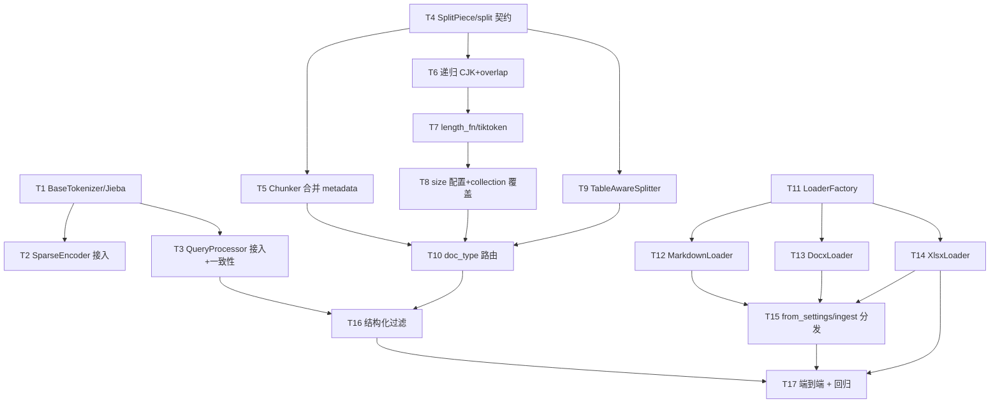

# Implementation Plan

## Overview

本计划实现 Ingestion Pipeline 本轮功能完善（多格式 Loader + 共享 jieba 分词 + 切分契约升级 + 默认递归增强 + 表格感知与路由 + 查询结构化过滤），共 17 个任务，每个任务均带单元测试，按依赖顺序推进。

> 落地原则（对齐 DEV_SPEC）：
> - **TDD 优先**：每个任务都先写/补单元测试，再实现，测试通过即验收。
> - **小步可验收**：每个任务约 1 小时粒度，单独可测、可回滚。
> - **外部依赖可 Mock**：LLM / Embedding / MarkItDown / 真实文件在单测中用 Fake/Mock；集成测试再走真实后端。
> - **顺序**：分词器 → 切分契约 → 默认递归增强 → 表格感知+路由 → 多格式 Loader → 查询过滤 → 端到端。

## 进度跟踪表 (Progress Tracking)

> 状态：`[ ]` 未开始 ｜ `[~]` 进行中 ｜ `[x]` 已完成

| 任务编号 | 任务名称 | 单元测试 | 状态 | 备注 |
|---------|---------|---------|------|------|
| T1 | BaseTokenizer + JiebaTokenizer + 工厂/配置 | ✅ | [x] | |
| T2 | SparseEncoder 接入共享分词器 | ✅ | [x] | |
| T3 | QueryProcessor 接入共享分词器 + 一致性测试 | ✅ | [x] | Property 8 |
| T4 | SplitPiece + BaseSplitter.split() + 向后兼容 | ✅ | [x] | |
| T5 | DocumentChunker 合并 per-chunk 结构化 metadata | ✅ | [x] | |
| T6 | RecursiveSplitter：CJK 分隔符 + overlap 修正 | ✅ | [ ] | Property 11 |
| T7 | RecursiveSplitter：可插拔 length_fn + tiktoken + size_unit | ✅ | [ ] | Property 12 |
| T8 | size 配置化 + 按 collection 覆盖 | ✅ | [ ] | |
| T9 | TableAwareSplitter（表头重复 + sheet 边界 + 结构 metadata） | ✅ | [ ] | Property 13 |
| T10 | DocumentChunker 按 doc_type 路由 + by_doc_type 配置 | ✅ | [ ] | Property 14 |
| T11 | LoaderFactory + register_loader | ✅ | [ ] | Property 9 |
| T12 | MarkdownLoader | ✅ | [ ] | |
| T13 | DocxLoader | ✅ | [ ] | |
| T14 | XlsxLoader（产出 sheet 标记） | ✅ | [ ] | |
| T15 | Pipeline.from_settings / ingest.py 走 LoaderFactory | ✅ | [ ] | |
| T16 | 查询侧按结构化 metadata 过滤 | ✅ | [ ] | |
| T17 | 端到端：xlsx 摄取→按 sheet 过滤 + PDF 回归 | ✅ | [ ] | 集成测试 |

---

## Task Dependency Graph



```json
{
  "waves": [
    { "wave": 1, "tasks": ["1", "4", "11"] },
    { "wave": 2, "tasks": ["2", "3", "5", "6", "9", "12", "13", "14"] },
    { "wave": 3, "tasks": ["7", "15"] },
    { "wave": 4, "tasks": ["8"] },
    { "wave": 5, "tasks": ["10"] },
    { "wave": 6, "tasks": ["16"] },
    { "wave": 7, "tasks": ["17"] }
  ]
}
```

---

## Tasks

- [x] 1. BaseTokenizer + JiebaTokenizer + 工厂/配置
  - **目标**：建立统一分词抽象与默认 jieba 实现，供摄取与查询共享。
  - **修改文件**：`src/libs/tokenizer/base_tokenizer.py`、`src/libs/tokenizer/jieba_tokenizer.py`、`src/libs/tokenizer/tokenizer_factory.py`、`src/libs/tokenizer/__init__.py`、`tests/unit/test_tokenizer.py`
  - **实现**：`BaseTokenizer.tokenize(text)->list[str]`；`JiebaTokenizer`（中文 `jieba.cut`、ASCII 词/数字正则、统一小写、去停用词，合并现有中英停用词表）；`TokenizerFactory.create(settings)`（`retrieval.tokenizer: jieba|regex`，regex 回退字符级）。
  - **验收标准**：中文句子切出词级 token；中英混合正确切分；停用词被过滤；`tokenizer=regex` 时退回字符级行为。
  - **测试方法**：`pytest -q tests/unit/test_tokenizer.py`（含中文/混合/停用词/regex 回退用例）。
  - _Requirements: 2.1, 2.3_

- [x] 2. SparseEncoder 接入共享分词器
  - **目标**：移除 `SparseEncoder` 内置字符级正则，改用注入的 `BaseTokenizer`。
  - **修改文件**：`src/ingestion/embedding/sparse_encoder.py`、`tests/unit/test_sparse_encoder.py`
  - **实现**：构造函数接收 `tokenizer: BaseTokenizer`（默认由工厂创建）；`_tokenize` 委托给分词器；删除内置 `_TOKEN_RE`。
  - **验收标准**：相同文本产出与分词器一致的 term_freqs；空文本仍产出空 `SparseVector`；既有测试更新通过。
  - **测试方法**：`pytest -q tests/unit/test_sparse_encoder.py`（注入 Fake/Jieba 分词器断言词项）。
  - _Requirements: 2.5_

- [x] 3. QueryProcessor 接入共享分词器 + 一致性测试
  - **目标**：移除 `QueryProcessor` 重复正则，改用同一 `BaseTokenizer`，并固化"摄取↔查询"一致性。
  - **修改文件**：`src/core/query_engine/query_processor.py`、`tests/unit/test_query_processor.py`、`tests/unit/test_tokenizer_consistency.py`
  - **实现**：`QueryProcessor` 接收同一分词器；`_extract_keywords` 委托分词器后去重保序；删除重复 `_TOKEN_RE`。
  - **验收标准**：同一文本经 `SparseEncoder` 与 `QueryProcessor` 产出**完全相同**的 token 序列。
  - **测试方法**：`pytest -q tests/unit/test_tokenizer_consistency.py`（Property 8：参数化中文/英文/混合文本断言 token 序列相等）。
  - _Requirements: 2.2_

- [x] 4. SplitPiece + BaseSplitter.split() + 向后兼容
  - **目标**：升级切分接口以承载结构化 metadata，同时保持现有 `split_text` 调用不破坏。
  - **修改文件**：`src/libs/splitter/base_splitter.py`、`tests/unit/test_base_splitter_contract.py`
  - **实现**：`@dataclass SplitPiece(text, metadata={})`；`BaseSplitter.split(text)->list[SplitPiece]`（抽象）；`split_text` 默认基于 `split()` 仅取 `text`（向后兼容）。
  - **验收标准**：实现 `split()` 的子类自动获得正确的 `split_text`；`SplitPiece.metadata` 默认空 dict。
  - **测试方法**：`pytest -q tests/unit/test_base_splitter_contract.py`（用最小 Fake splitter 验证契约与兼容）。
  - _Requirements: 3.1, 3.2_

- [x] 5. DocumentChunker 合并 per-chunk 结构化 metadata
  - **目标**：让 chunker 把 `SplitPiece.metadata` 合并进 `Chunk.metadata`，与既有字段共存。
  - **修改文件**：`src/ingestion/chunking/document_chunker.py`、`tests/unit/test_document_chunker.py`
  - **实现**：改 `split_document` 消费 `splitter.split()`；`_inherit_metadata` 合并 piece.metadata（不覆盖 `chunk_index`/`image_refs`/`source_ref`）。
  - **验收标准**：散文型（空 metadata）行为与现状一致；piece 带结构字段时正确落入 `chunk.metadata`；chunk id 仍确定性。
  - **测试方法**：`pytest -q tests/unit/test_document_chunker.py`（FakeSplitter 返回带/不带 metadata 的 piece）。
  - _Requirements: 3.3, 3.4, 3.5_

- [ ] 6. RecursiveSplitter：CJK 分隔符 + overlap 修正
  - **目标**：消除长中文段落被切成单字；overlap 衔接不强插空格。
  - **修改文件**：`src/libs/splitter/recursive_splitter.py`、`tests/unit/test_recursive_splitter_cjk.py`
  - **实现**：分隔符表加入 `。！？；，` 与英文句末；改 `split_text`→实现 `split()` 返回 `SplitPiece(text)`；overlap 拼接去掉强插空格。
  - **验收标准**：不含换行的长中文段不产生长度为 1 的字符碎片；在中文标点处断开；代码块不被破坏。
  - **测试方法**：`pytest -q tests/unit/test_recursive_splitter_cjk.py`（Property 11：中文长段/代码块用例）。
  - _Requirements: 4.1, 4.2, 4.6, 4.7_

- [ ] 7. RecursiveSplitter：可插拔 length_fn + tiktoken + size_unit
  - **目标**：切分大小度量从字符改为可插拔长度函数，默认按 token（tiktoken）。
  - **修改文件**：`src/libs/splitter/recursive_splitter.py`、`src/libs/splitter/length.py`（token/char 计数器）、`tests/unit/test_splitter_length.py`
  - **实现**：`length_fn: Callable[[str],int]` 注入，内部 `len(text)`→`self._length(text)`；`length.py` 提供 `char_length` 与基于 tiktoken 的 `token_length(encoding)`；`size_unit: token|char` 决定使用哪个（token 编码默认对齐 embedding 模型）。
  - **验收标准**：`size_unit=token` 时每块 token 数不超过 `chunk_size`（不可分兜底块除外）；同一文本在 char 与 token 下分块边界不同；tiktoken 缺失时给出可读错误或回退 char。
  - **测试方法**：`pytest -q tests/unit/test_splitter_length.py`（Property 12：token vs char 边界对比）。
  - _Requirements: 4.3, 4.4_

- [ ] 8. size 配置化 + 按 collection 覆盖
  - **目标**：`chunk_size/overlap` 从 settings 读取，并支持按 collection 覆盖。
  - **修改文件**：`src/core/settings.py`（splitter 配置结构）、`src/libs/splitter/splitter_factory.py`、`src/ingestion/chunking/document_chunker.py`、`config/settings.yaml`、`tests/unit/test_splitter_config.py`
  - **实现**：Settings 增加 `splitter.{type,size_unit,chunk_size,chunk_overlap,by_doc_type,overrides}`；`DocumentChunker.split_document(document, collection)` 按 collection 解析生效 size（overrides 优先）。
  - **验收标准**：无覆盖时用默认；`overrides.faq` 等生效；缺字段有默认值不报错。
  - **测试方法**：`pytest -q tests/unit/test_splitter_config.py`（覆盖解析、默认回退）。
  - _Requirements: 4.5, 6.1, 6.2, 6.3_

- [ ] 9. TableAwareSplitter（表头重复 + sheet 边界 + 结构 metadata）
  - **目标**：对 Markdown 表格按行成块、每块重复表头、按 sheet 切，并产出结构化 metadata。
  - **修改文件**：`src/libs/splitter/table_aware_splitter.py`、`tests/unit/test_table_aware_splitter.py`
  - **实现**：识别 `| ... |` 表格块与 `|---|` 分隔行；按 token 预算分行成块、每块前置表头；按 sheet 标题（`## {sheet_name}`）归属；非表格文本回退默认递归；`split()` 返回带 `sheet_name/row_start/row_end/is_table` 的 `SplitPiece`；注册到 `SplitterFactory`（`table_aware`）。
  - **验收标准**：每块以表头开头；不跨 sheet 混行；metadata 含 sheet 名与行区间；夹杂的非表格文本回退递归。
  - **测试方法**：`pytest -q tests/unit/test_table_aware_splitter.py`（Property 13：多 sheet、混合文本、超行表格用例）。
  - _Requirements: 5.2, 5.3, 5.4, 5.5_

- [ ] 10. DocumentChunker 按 doc_type 路由 + by_doc_type 配置
  - **目标**：按 `document.metadata["doc_type"]` 选择切分器，未命中走默认递归。
  - **修改文件**：`src/ingestion/chunking/document_chunker.py`、`tests/unit/test_chunker_routing.py`
  - **实现**：构造默认切分器 + `by_doc_type` 映射；`split_document` 按 doc_type 选择；未配置时全部走默认。
  - **验收标准**：`doc_type=xlsx`→table_aware；其他→recursive；散文型 piece.metadata 为空；无 by_doc_type 配置时行为与现状一致。
  - **测试方法**：`pytest -q tests/unit/test_chunker_routing.py`（Property 14：路由命中/未命中）。
  - _Requirements: 5.1, 5.6_

- [ ] 11. LoaderFactory + register_loader
  - **目标**：按扩展名路由 Loader 的工厂。
  - **修改文件**：`src/libs/loader/loader_factory.py`、`src/libs/loader/__init__.py`、`tests/unit/test_loader_factory.py`
  - **实现**：`register_loader(extensions, factory_fn)`；`LoaderFactory.create(path)` 按扩展名返回 Loader；未知扩展名抛含可用列表的 `ValueError`；注册既有 `PdfLoader`。
  - **验收标准**：`.pdf` 路由到 PdfLoader；未知扩展名报错信息含可用列表。
  - **测试方法**：`pytest -q tests/unit/test_loader_factory.py`（Property 9：路由 + 未知扩展名）。
  - _Requirements: 1.1, 1.5_

- [ ] 12. MarkdownLoader
  - **目标**：直接读取 Markdown 文件为 Document，并解析本地图片链接。
  - **修改文件**：`src/libs/loader/markdown_loader.py`、`tests/unit/test_markdown_loader.py`
  - **实现**：读取文本（不经 MarkItDown）；`doc_type=markdown`、`doc_id=md_{hash[:12]}`；解析 `` 为 `ImageRef`（缺失降级跳过）；注册 `.md/.markdown`。
  - **验收标准**：产出 Document 含 `source_path/doc_type/doc_hash`；图片链接被解析；坏链接降级不阻塞。
  - **测试方法**：`pytest -q tests/unit/test_markdown_loader.py`（纯文本 / 含图片链接 / 坏链接）。
  - _Requirements: 1.2, 1.4, 1.6_

- [ ] 13. DocxLoader
  - **目标**：经 MarkItDown 把 docx 转为规范化 Markdown。
  - **修改文件**：`src/libs/loader/docx_loader.py`、`tests/unit/test_docx_loader.py`
  - **实现**：MarkItDown 转换；`doc_type=docx`、`doc_id=docx_{hash[:12]}`；MVP 暂不提取内嵌图片（降级为无图）；注册 `.docx`。
  - **验收标准**：产出 Document 含必需 metadata；MarkItDown 失败时降级记录警告不抛致命异常。
  - **测试方法**：`pytest -q tests/unit/test_docx_loader.py`（mock MarkItDown 返回 Markdown；失败降级）。
  - _Requirements: 1.3, 1.4, 1.6_

- [ ] 14. XlsxLoader（产出 sheet 标记）
  - **目标**：把 xlsx 转为 Markdown 表格，并为每个 sheet 产出可识别的标题标记，供表格切分归属 sheet。
  - **修改文件**：`src/libs/loader/xlsx_loader.py`、`tests/unit/test_xlsx_loader.py`
  - **实现**：MarkItDown 转换；为每个 sheet 前置 `## {sheet_name}` 标记；`doc_type=xlsx`、`doc_id=xlsx_{hash[:12]}`；注册 `.xlsx`。
  - **验收标准**：每个 sheet 有标题标记 + Markdown 表格；metadata 完整；多 sheet 顺序稳定。
  - **测试方法**：`pytest -q tests/unit/test_xlsx_loader.py`（mock MarkItDown；单/多 sheet）。
  - _Requirements: 1.3, 1.4_

- [ ] 15. Pipeline.from_settings / ingest.py 走 LoaderFactory
  - **目标**：装配与脚本入口不再硬编码 PdfLoader，改为按文件类型分发。
  - **修改文件**：`src/ingestion/pipeline.py`、`scripts/ingest.py`、`tests/unit/test_pipeline_loader_dispatch.py`
  - **实现**：`from_settings` 用 `LoaderFactory.create(source_path)`（或在 run 时按 path 选择）；`ingest.py` 支持多格式文件/目录。
  - **验收标准**：对 `.pdf/.md/.docx/.xlsx` 分别选到正确 Loader；未知类型报清晰错误。
  - **测试方法**：`pytest -q tests/unit/test_pipeline_loader_dispatch.py`（注入 Fake loaders 断言分发）。
  - _Requirements: 1.7_

- [ ] 16. 查询侧按结构化 metadata 过滤
  - **目标**：查询支持按 `sheet_name` 等结构字段过滤，并在结果中携带这些字段。
  - **修改文件**：`src/core/query_engine/query_processor.py`（filters 透传）、`src/core/query_engine/hybrid_search.py` 或检索器过滤应用处、`tests/unit/test_structured_filter.py`
  - **实现**：复用既有通用 `filters` 通道，对 chunk metadata 做匹配过滤；结果保留 `sheet_name/row` 字段用于引用。
  - **验收标准**：带 `sheet_name` 过滤时仅返回匹配 chunk；不带过滤时行为不变；主流程顺序不变。
  - **测试方法**：`pytest -q tests/unit/test_structured_filter.py`（构造带 sheet metadata 的候选断言过滤）。
  - _Requirements: 7.1, 7.2, 7.3_

- [ ] 17. 端到端：xlsx 摄取→按 sheet 过滤 + PDF 回归
  - **目标**：打通新链路的集成验证，并保证既有 PDF 流程不回归。
  - **修改文件**：`tests/integration/test_multiformat_ingestion.py`、`tests/fixtures/sample_documents/sample.xlsx`、`tests/fixtures/sample_documents/sample.md`
  - **实现**：对 xlsx 跑完整 pipeline（jieba 分词 + 表格切分 + 结构 metadata），再按 `sheet_name` 查询；保留既有 PDF e2e 用例。
  - **验收标准**：xlsx chunk 带 sheet metadata 且可被 sheet 过滤命中；PDF 端到端集成测试仍通过。
  - **测试方法**：`pytest -q tests/integration/test_multiformat_ingestion.py tests/integration/test_ingestion_pipeline.py`。
  - _Requirements: 1.4, 5.4, 7.1_

---

## Notes

- **分词器迁移**：T1–T3 切换为 jieba 后，BM25 词表改变，**既有 BM25 索引需重建**（重新摄取语料）。在 T17 端到端前完成重摄。
- **两个分词器边界**：jieba（T1，BM25 词表）与 tiktoken（T7，切分大小度量）是独立组件，勿混用。
- **向后兼容**：T4 的 `split_text` 保留兼容；T6 起各切分器统一实现 `split()`。
- **外部依赖 Mock**：T12–T14 的 MarkItDown、T7 的 tiktoken、T1 的 jieba 在单测中按需 mock；T17 走真实样例文件。
- **范围之外**：内容类型自动识别、语义/父子分块、pptx/code 专用切分、性能优化均不在本轮。
