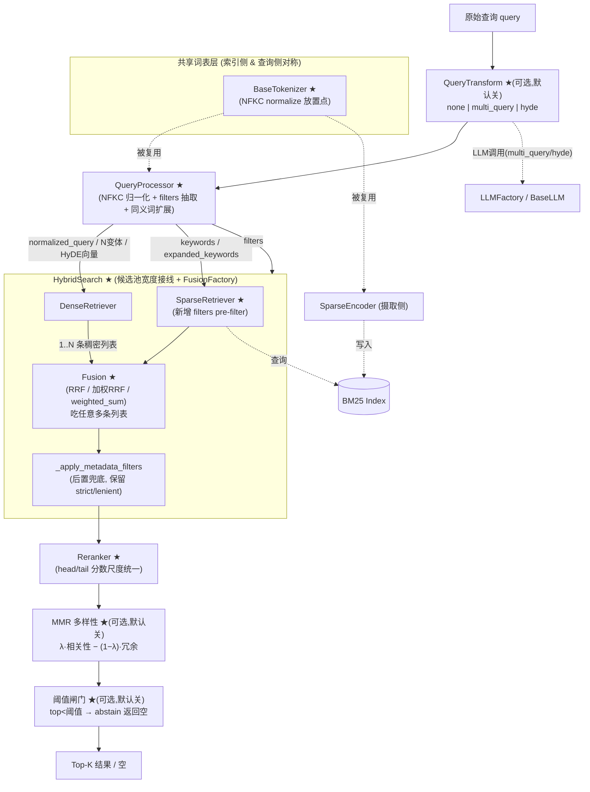

# 设计文档：Phase D 检索增强（phase-d-retrieval-enhancements）

## Overview

（概述）

本特性是对**已实现的 Phase D 检索流水线**（D1–D7：`QueryProcessor` / `DenseRetriever` / `SparseRetriever` / RRF `Fusion` / `HybridSearch` / `Reranker` / `scripts/query.py`）的一次**重构与增强**，**而非新建**。它修复一批"配置漂移"与"规范落地缺口"，并补齐 `DEV_SPEC.md` 已经声明、但当前代码尚未兑现的若干能力。

增强围绕一条主线展开：让查询侧与索引侧的 BM25 词表保持对齐、让 `settings.yaml` 中既有的配置项真正生效、并让融合 / 过滤 / 重排三个阶段的行为符合 DEV_SPEC 3.1.2 与 3.3.5 的约定。所有改动都落在现有 `src/core/query_engine/` 与共享 `src/libs/tokenizer/` 模块上，复用项目既有的工厂模式（`*_Factory`）与优雅降级约定。

本设计**限定在 Phase D / query_engine 范围内**，但额外纳入四项"进阶检索增强"（多查询扩展、HyDE、MMR/去重、相关性阈值），全部以**可插拔、默认关闭的开关**形式落地——即默认配置下行为与 #1–#7 完全一致，启用与否由 `settings.yaml` 控制。这样既预留了能力插槽（后期无需改架构即可开启），又不破坏现有行为，同时作为学习项目可逐项实践这些经典技术。评估 harness、Dashboard、chunking 改造仍属其它阶段，列为范围外（见末尾"范围外 / 未来工作"）。

### 涉及的增强点（与现有代码一一对应）

| # | 增强点 | 涉及的现有类 / 方法 | 性质 |
|---|--------|----------------------|------|
| 1 | 查询归一化加强（NFKC+大小写+全半角+可选繁简） | `BaseTokenizer` 共享 `normalize_text` + `QueryProcessor._normalize` | 规范落地 + 词表对齐 |
| 2 | filters 从查询文本解析 | `QueryProcessor._parse_filters`（新增抽取步骤） | 规范落地（DEV_SPEC 3.1.2） |
| 3 | 候选池宽度配置接线修复 | `HybridSearch.search` / `__init__` / `from_settings` | 配置漂移修正 |
| 4 | 加权融合 + `FusionFactory` | `fusion.py` + `HybridSearch.from_settings` | 配置漂移修正 + 新能力 |
| 5 | 稀疏路 pre-filter | `SparseRetriever.retrieve` | 规范落地（能前置则前置） |
| 6 | rerank head/tail 分数尺度统一 | `Reranker.rerank` / `_finalize` | 一致性修复 |
| 7 | 同义词/别名 OR-扩展进 BM25 | `QueryProcessor` + `SparseRetriever` | spec-baseline 扩展 |
| 8 | 多查询扩展（Multi-Query，可选） | 新增 `QueryTransform` + 复用 `Fusion` | 进阶增强（默认关） |
| 9 | HyDE 假设性文档嵌入（可选） | 新增 `QueryTransform` + `DenseRetriever` | 进阶增强（默认关） |
| 10 | MMR / 去重（可选） | 新增 `diversity.py`，rerank 后阶段 | 进阶增强（默认关） |
| 11 | 相关性阈值 / 无答案（通用基线） | `Reranker` / `HybridSearch` 末端 | 进阶增强（默认关，校准延后） |

---

# 第一部分：高层设计（High-Level Design）

## Architecture

（架构）

下图标出本特性触碰的组件（★ = 本次修改 / 新增），未触碰组件保持原样。



### 关键架构约束

- **词表对称性（最重要）**：BM25 在摄取侧（`SparseEncoder`）与查询侧（`QueryProcessor`）通过**同一个** `BaseTokenizer`（默认 `JiebaTokenizer`，经 `TokenizerFactory` 创建）进行分词。任何会改变 token 形态的归一化（如 NFKC）**必须放进共享分词层**，否则查询侧词形与索引侧词形不一致，BM25 命中率骤降。
- **优雅降级保持不变**：`HybridSearch._run_dense` / `_run_sparse` 的"单路失败即降级到另一路"行为必须保留。
- **过滤策略保持不变**：`_apply_metadata_filters` 的"结构化字段 strict（missing→exclude）/ 通用字段 lenient（missing→include）"双策略保持不变；本次只是把"能前置"的部分前移，后置兜底仍在。

## Components and Interfaces

（组件变更摘要）

### 1. 共享词表层 `src/libs/tokenizer/`（确定性归一化放置点）
- 新增共享 `normalize_text`：NFKC（全半角/兼容字符）+ casefold（大小写）+ 可选繁简（OpenCC），在 `BaseTokenizer` 实现的分词入口统一调用。
- 因为 `SparseEncoder`（索引侧）与 `QueryProcessor`（查询侧）都经此层，BM25 词表自动对称。
- 稠密侧（`DenseRetriever`）经 `QueryProcessor._normalize` 复用同一 `normalize_text`，两路 form 一致、零额外延迟。

### 2. `QueryProcessor`（D1）
- `_normalize`：在折叠空白之外，对 `normalized_query` 也应用 NFKC（供稠密侧使用；BM25 侧的 NFKC 由分词层负责，二者一致）。
- 新增**可插拔的 filters 抽取步骤**（规则/模式优先），把结构化约束从查询文本解析进通用 `filters`。
- 新增**轻量同义词/别名 OR-扩展**：产出 `expanded_keywords`，原始关键词权重更高，仅用于 BM25，稠密侧保持单次。

### 3. `HybridSearch`（D5）
- `candidate_k` 改为由 `settings.retrieval.top_k_dense` / `top_k_sparse` 驱动，`candidate_multiplier` 改为配置驱动（不再硬编码 `2`）。
- `from_settings` 改用 `FusionFactory.create(settings)` 取代硬编码的 `ReciprocalRankFusion`。
- 向 `SparseRetriever.retrieve` 传入 `filters`（前置过滤）。

### 4. `fusion.py` + 新增 `FusionFactory`（D4）
- 新增 `FusionFactory`，与项目其它工厂（LLM/Embedding/Reranker/Tokenizer）形态一致，依据 `settings.retrieval.fusion_algorithm`（`rrf | weighted_sum`）创建融合器。
- `ReciprocalRankFusion` 支持**每路可选权重**：`fused = Σ weight_i / (k + rank)`。
- 新增 `WeightedSumFusion`（基于归一化分数的加权和）作为 `weighted_sum` 选项。

### 5. `SparseRetriever`（D3）
- `retrieve` 新增 `filters` 形参，实现"能前置则前置"：BM25 倒排索引本身不支持 metadata filter，故采用**超额取回 + 在 `get_by_ids` 解析阶段按 metadata 过滤**的策略。

### 6. `Reranker`（D6）
- 修复 `reordered(head, cross-encoder 分数) + tail(RRF 分数)` 的分数尺度混用问题，确立合并列表的一致排序契约。

### 7. 同义词/别名 OR-扩展（`QueryProcessor` + `SparseRetriever`）
- `QueryProcessor` 产出 `expanded_keywords`（原词 + 同义词/别名，OR 合并，原词在前）；`HybridSearch` 把它传给稀疏路，稠密路仍单次。默认关。

### 8 & 9. 新增 `QueryTransform`（多查询 / HyDE，统一策略组件）
- 新增 `src/core/query_engine/query_transform.py`：`BaseQueryTransform`（抽象）+ 具体策略，模式由 `retrieval.query_transform: none | multi_query | hyde` 选择，**默认 `none`**（恒等，行为不变）。这是一个清晰的策略模式教学点。
- **multi_query**：LLM 把查询改写成 N 个语义等价变体，**每个变体各跑一次稠密检索**，产出 N 条稠密列表，连同稀疏列表一起交给既有 `Fusion.fuse(list[list])`——**融合层零改动**（它本就吃任意多条列表）。内置**并发上限**与**改写缓存**控制成本。
- **hyde**：LLM 生成一段假设性答案文档，embedding 后用于稠密检索；可配置**替换**原查询向量或**并列追加**（两者都作为稠密列表进融合）。**按 doc_type 门控**（结构化/表格类如 xlsx 可跳过，避免幻觉具体值；PDF/Markdown 等非结构化适用）。
- 两种模式都复用项目 `LLMFactory`/`BaseLLM`；**LLM 失败必须降级为单查询**（原行为），不阻断查询。
- 与 §7 同义词扩展相互独立：后者只动 BM25、单次、不调 LLM。

### 10. 新增 MMR 多样性阶段（`src/core/query_engine/diversity.py`）
- rerank 之后、最终 top_k 裁剪之前的**可选**多样性重排：`score = λ·相关性 − (1−λ)·与已选集合的最大相似度`。
- `enable_mmr`（默认 false）+ `mmr_lambda`（默认 0.5）。相似度复用候选的稠密向量（无则经 embedding 客户端补算）。专治项目已知的"同字干扰（刘静/周静）/ 同表相似行扎堆"。默认关 = 恒等。

### 11. 相关性阈值 / 无答案（abstain，通用基线）
- 流水线末端（rerank/MMR 之后）的**可选**阈值闸门：若 Top1 分数 < `min_score_threshold`，返回**空**（"知识库未覆盖"），避免把低质结果喂给上层 MCP/LLM 引发自信幻觉。
- `min_score_threshold`（默认 `0.0` = 关闭，行为不变）。**依赖 #6 的分数尺度统一**才有可比基准；阈值**具体取值的校准延后**到有评估集的阶段，本期只落通用机制。

## Data Models

（数据模型）

本特性主要扩展现有数据模型，不引入新的存储结构。

### `ProcessedQuery`（修改 — `query_processor.py`）
```python
@dataclass
class ProcessedQuery:
    raw_query: str
    normalized_query: str                                      # 已做 NFKC + 折叠空白
    keywords: list[str] = field(default_factory=list)          # 原始关键词
    expanded_keywords: list[str] = field(default_factory=list) # ★ 新增：原词 + 同义词/别名(OR)
    filters: dict[str, Any] = field(default_factory=dict)      # 外部 ⊕ 抽取
```
**约束**：`expanded_keywords` 必含 `keywords` 全集且原词在前；`filters` 丢弃 None 值；`normalized_query` 与 BM25 分词层使用同一 NFKC form。

### `RetrievalConfig`（修改 — `settings.py`）
见下文"配置 / 开关设计"中的完整字段表。新增字段全部带默认值，缺省即退化为当前行为（向后兼容）。

### 通用 `filters` dict（契约不变）
键空间分两类，与 `HybridSearch._STRUCTURED_FILTER_KEYS` 一致：
- **结构化键**：`sheet_name` / `row_start` / `row_end` / `is_table` —— strict（missing→exclude）。
- **通用键**：`collection` / `doc_type` / `language` / … —— lenient（missing→include）。

### `RetrievalResult`（不变，新增 metadata 约定）
`Reranker` 统一分数后，在 `metadata` 写入 `raw_score`（原始分数）与 `score_source`（`"cross_encoder" | "rrf"`），既有 `rerank_fallback` / `rerank_backend` 保留。

## 数据流对比（Before / After）

### Before（当前实现）
```
query
  → QueryProcessor.process()         # _normalize 仅折叠空白；_parse_filters 仅透传外部 filters
      keywords / filters(透传) / normalized
  → candidate_k = top_k * 2          # 硬编码 multiplier，忽略 settings.top_k_dense/sparse
  → DenseRetriever.retrieve(normalized, filters)     # 稠密有 filters
    SparseRetriever.retrieve(keywords)               # 稀疏【无 filters】，绕过前置
  → ReciprocalRankFusion.fuse()      # from_settings 硬编码 RRF，忽略 fusion_algorithm
  → _apply_metadata_filters()        # 后置兜底（唯一的稀疏过滤点）
  → Top-K
  → Reranker.rerank()                # head=cross-encoder 分数, tail=RRF 分数（尺度混用）
```

### After（本设计）
```
query
  → QueryTransform.transform()       # 可选,默认none恒等; multi_query→N变体; hyde→假设文档向量; LLM失败降级单查询
  → QueryProcessor.process()
      ├─ _normalize: 折叠空白 + NFKC（稠密侧）
      ├─ keywords: 经共享分词层（NFKC 已在分词层统一 → BM25 词表对齐）
      ├─ expanded_keywords: keywords + 同义词/别名（OR 扩展，原词权重更高）
      └─ filters: 透传外部 filters ⊕ 从查询文本规则抽取的结构化约束
  → candidate_k_dense  = top_k_dense  * candidate_multiplier   # 配置驱动
    candidate_k_sparse = top_k_sparse * candidate_multiplier
  → DenseRetriever.retrieve(...)  ×(1 或 N 条,取决于 query_transform)
    SparseRetriever.retrieve(expanded_keywords, filters)       # 前置过滤（over-fetch + 解析期过滤）
  → FusionFactory.create(settings).fuse([dense_1..N, sparse], weights=...)  # rrf(可加权) | weighted_sum
  → _apply_metadata_filters()        # 后置兜底仍保留（strict/lenient 策略不变）
  → Top-K
  → Reranker.rerank()                # head/tail 统一到单调一致的分数尺度
  → MMR 多样性                        # 可选,默认关(λ=1或关闭即恒等)
  → 阈值闸门                          # 可选,默认阈值0=不 abstain；Top1<阈值→返回空
```

---

# 第二部分：低层设计（Low-Level Design）

## 1. 确定性文本归一化（共享层，中文场景）

**放置原则（关键）**：所有"会改变 token 形态"的确定性归一化——NFKC（全角→半角、兼容字符折叠）、大小写折叠（casefold）、繁简归一——**必须放进被索引侧与查询侧共用的同一处**，否则 BM25 词表不对称、命中率下降。落点是一个共享 `normalize_text` 工具：

- **sparse 两侧**：`JiebaTokenizer` / `RegexTokenizer` 的 `tokenize` 入口调用 `normalize_text` → 摄取侧 `SparseEncoder` 与查询侧 `QueryProcessor._extract_keywords` 自动对称。
- **dense 侧**：`QueryProcessor._normalize` 调用**同一个** `normalize_text`，保证稠密查询文本与稀疏词表用同一归一化 form。
- 因此"对 dense 与 sparse 两路都受益"成立的前提，是归一化在**共享层**而非仅 `_normalize`。

```python
# src/libs/tokenizer/normalize.py （新增共享工具，tokenizer 两侧 + _normalize 共用）
import unicodedata

def normalize_text(text: str, *, casefold: bool = True,
                   to_simplified: bool = False) -> str:
    """分词/嵌入前的确定性归一化流水线（顺序固定，保证幂等可复现）：
      1) NFKC      —— 全角→半角、兼容字符折叠（stdlib，零依赖）
      2) casefold  —— 大小写折叠（stdlib，零依赖；比 lower() 更彻底）
      3) 繁简归一  —— 可选，需 OpenCC（外部依赖）；缺失则跳过并 warning

    必须在索引侧(SparseEncoder)与查询侧(QueryProcessor)共用，
    以保证 BM25 词表对称。
    """
    if not text:
        return ""
    text = unicodedata.normalize("NFKC", text)
    if casefold:
        text = text.casefold()
    if to_simplified:
        text = _to_simplified(text)   # OpenCC（t2s）；未安装则原样返回 + warning
    return text
```

```python
# src/libs/tokenizer/jieba_tokenizer.py （修改 tokenize 入口）
def tokenize(self, text: str) -> list[str]:
    if not text or not text.strip():
        return []
    text = normalize_text(text, casefold=self._casefold,
                          to_simplified=self._to_simplified)   # ★ 分词前确定性归一化
    # ...（其余 CJK/ASCII 切分逻辑不变；原先在分词内部的 lower 由 casefold 统一承担）
```

```python
# src/core/query_engine/query_processor.py （_normalize 复用同一归一化，服务稠密侧）
def _normalize(self, query: str) -> str:
    if not query:
        return ""
    text = normalize_text(query, casefold=self._casefold,
                          to_simplified=self._to_simplified)   # ★ 与稀疏词表同一 form
    return re.sub(r"\s+", " ", text).strip()
```

> **关键点**：归一化参数（`casefold` / `to_simplified`）必须在 tokenizer 与 `QueryProcessor` 间保持一致——二者都从 `settings.retrieval` 读取，避免两侧 form 漂移。`RegexTokenizer` 同样在入口调用 `normalize_text`，切换 tokenizer 不丢对称性。原先散落在分词内部的 `lower()` 由 `casefold` 统一接管，消除重复/不一致。

> **繁简依赖与降级**：繁简归一不属于 Unicode 归一化（NFKC 不做繁→简），需 `OpenCC`。`_to_simplified` 在 OpenCC 未安装时记 warning 并原样返回（等同关闭该项），不阻断。启用繁简同样需**重跑摄取**重建 BM25 索引（见影响表）。

## 2. filters 从查询文本抽取（可插拔，规则优先）

引入一个轻量、可选、可后续接 LLM 的抽取器接口；`QueryProcessor` 持有一个可空的 `filter_extractor`。

```python
# src/core/query_engine/filter_extractor.py （新增）
from __future__ import annotations
from abc import ABC, abstractmethod
from typing import Any

class BaseFilterExtractor(ABC):
    """从查询文本中解析结构化约束为通用 filters。可插拔、可空。"""
    @abstractmethod
    def extract(self, query: str) -> dict[str, Any]:
        """返回抽取到的 filters 子集；无命中返回 {}。不得抛异常。"""
        ...

class RuleBasedFilterExtractor(BaseFilterExtractor):
    """规则/模式抽取（Phase D 基线）。例如：
       - "在 <sheet名> 这张表里" → {"sheet_name": ...}
       - "只看表格" / "table" → {"is_table": True}
       - "doc_type:pdf" / "collection:faq" 等显式键值
    """
    def extract(self, query: str) -> dict[str, Any]:
        filters: dict[str, Any] = {}
        # 1) 显式 key:value 模式
        # 2) 结构化关键词模式（sheet_name / is_table / row 区间）
        # ... 规则实现（保持轻量，命中才写入）
        return filters
```

```python
# QueryProcessor.__init__ / process / _parse_filters 修改
def __init__(
    self,
    tokenizer: BaseTokenizer | None = None,
    filter_extractor: "BaseFilterExtractor | None" = None,   # ★ 可空，默认不启用
    synonym_map: dict[str, list[str]] | None = None,         # ★ 见 §7
):
    self._tokenizer = tokenizer or JiebaTokenizer()
    self._filter_extractor = filter_extractor
    self._synonyms = synonym_map or {}

def _parse_filters(
    self, filters: dict[str, Any] | None, query: str
) -> dict[str, Any]:
    """合并：外部预置 filters ⊕ 从查询文本抽取的 filters。

    合并策略：外部显式 filters 优先级更高（不被抽取结果覆盖），
    抽取结果只填补外部未提供的键。None 值一律丢弃（保持原契约）。
    """
    merged: dict[str, Any] = {}
    if self._filter_extractor is not None:
        merged.update(self._filter_extractor.extract(query))   # 抽取（低优先）
    if filters:
        merged.update({k: v for k, v in filters.items() if v is not None})  # 外部（高优先）
    return {k: v for k, v in merged.items() if v is not None}
```

> 抽取得到的结构化键（`sheet_name`/`row_start`/`row_end`/`is_table`）与 `HybridSearch._STRUCTURED_FILTER_KEYS` 一致，因而能直接被既有的 strict 后置策略消费。抽取器**默认不启用**（`filter_extractor=None` → 行为与今日一致），通过 `from_settings` 配置开启。

## 3. 候选池宽度配置接线修复（HybridSearch）

```python
# HybridSearch.__init__
def __init__(
    self,
    query_processor, dense_retriever, sparse_retriever, fusion,
    settings: "Settings | None" = None,
    candidate_multiplier: int = 2,
    top_k_dense: int = 20,    # ★ 新增，来自 settings.retrieval.top_k_dense
    top_k_sparse: int = 20,   # ★ 新增，来自 settings.retrieval.top_k_sparse
):
    ...
    self._multiplier = max(1, candidate_multiplier)
    self._top_k_dense = max(1, top_k_dense)
    self._top_k_sparse = max(1, top_k_sparse)
```

```python
# HybridSearch.search —— 候选池宽度取配置值与请求值的较大者后乘以 multiplier
def search(self, query, top_k=10, filters=None, trace=None):
    ...
    processed = self._qp.process(query, filters=filters, trace=trace)
    # 配置驱动的候选池宽度（不再 top_k * 硬编码2）
    dense_k  = max(top_k, self._top_k_dense)  * self._multiplier
    sparse_k = max(top_k, self._top_k_sparse) * self._multiplier

    dense_results  = self._run_dense(processed,  dense_k,  trace)
    sparse_results = self._run_sparse(processed, sparse_k, trace)
    ...
```

```python
# HybridSearch.from_settings —— 接线 settings + 工厂
@classmethod
def from_settings(cls, settings, **overrides):
    from src.core.query_engine.fusion_factory import FusionFactory   # ★
    ...
    fusion = overrides.get("fusion") or FusionFactory.create(settings)  # ★ 替换硬编码 RRF
    r = settings.retrieval
    return cls(
        qp, dense, sparse, fusion, settings=settings,
        candidate_multiplier=getattr(r, "candidate_multiplier", 2),  # ★ 配置驱动
        top_k_dense=getattr(r, "top_k_dense", 20),                   # ★
        top_k_sparse=getattr(r, "top_k_sparse", 20),                 # ★
    )
```

## 4. FusionFactory + 加权融合

### FusionFactory（与项目其它工厂同构）

```python
# src/core/query_engine/fusion_factory.py （新增）
from __future__ import annotations
from typing import TYPE_CHECKING
from src.core.query_engine.fusion import (
    BaseFusion, ReciprocalRankFusion, WeightedSumFusion,
)
if TYPE_CHECKING:
    from src.core.settings import Settings

class FusionFactory:
    """依据 settings.retrieval.fusion_algorithm 创建融合器（rrf | weighted_sum）。

    缺省回退到 'rrf'，未知算法抛 ValueError（与其它工厂一致）。
    """
    @staticmethod
    def create(settings: "Settings") -> BaseFusion:
        r = getattr(settings, "retrieval", None)
        name = (getattr(r, "fusion_algorithm", None) or "rrf").lower()
        weights = getattr(r, "fusion_weights", None)   # 例如 {"dense": 1.0, "sparse": 1.0}
        if name == "rrf":
            return ReciprocalRankFusion(
                k=getattr(r, "rrf_k", 60), weights=weights,
            )
        if name == "weighted_sum":
            return WeightedSumFusion(weights=weights)
        raise ValueError(
            f"Unknown fusion_algorithm '{name}'. Available: rrf, weighted_sum"
        )
```

### 抽出 `BaseFusion` 接口 + 加权 RRF

```python
# src/core/query_engine/fusion.py （新增 BaseFusion，扩展 RRF 支持每路权重）
class BaseFusion(ABC):
    @abstractmethod
    def fuse(
        self,
        result_lists: list[list[RetrievalResult]],
        top_k: int | None = None,
        trace: "TraceContext | None" = None,
    ) -> list[RetrievalResult]: ...

class ReciprocalRankFusion(BaseFusion):
    def __init__(self, k: int = 60, weights: dict[str, float] | list[float] | None = None):
        if k <= 0:
            raise ValueError("RRF k must be a positive integer")
        self._k = k
        self._weights = weights   # 可空：None → 各路权重 1.0

    def fuse(self, result_lists, top_k=None, trace=None):
        # 加权 RRF：fused = Σ_i  weight_i / (k + rank)
        rrf_scores: dict[str, float] = {}
        payloads: dict[str, RetrievalResult] = {}
        for list_idx, results in enumerate(result_lists):
            w = self._weight_for(list_idx)          # 默认 1.0
            for rank, item in enumerate(results, start=1):
                cid = item.chunk_id
                rrf_scores[cid] = rrf_scores.get(cid, 0.0) + w / (self._k + rank)
                payloads.setdefault(cid, item)
        # 确定性排序：score desc, chunk_id asc（保持原契约）
        ...
```

**加权 RRF 公式**（约定路顺序为 `[dense, sparse]`）：

```
fused_score(d) = Σ_{i ∈ 出现d的路}  w_i / (k + rank_i(d))

其中 w_dense, w_sparse 来自 settings.retrieval.fusion_weights；
未配置时 w_i = 1.0，退化为标准 RRF（向后兼容，输出与当前实现一致）。
```

> `WeightedSumFusion` 对每路分数做 min-max 归一化后按权重求和；它对绝对分数敏感，作为 `weighted_sum` 选项提供。RRF（默认）仍是推荐项。

## 5. 稀疏路 pre-filter（SparseRetriever）

BM25 倒排索引不存 metadata，无法原生过滤。策略：**超额取回（over-fetch）→ 在 `get_by_ids` 解析阶段按 metadata 过滤 → 截断到 top_k**。复用 `HybridSearch._apply_metadata_filters` 同款的 strict/lenient 判定，保证前后置语义一致。

```python
# SparseRetriever.retrieve （新增 filters 形参）
def retrieve(
    self,
    keywords: list[str],
    top_k: int = 20,
    filters: dict[str, Any] | None = None,   # ★ 新增
    overfetch: int = 4,                       # ★ 过滤时的超额取回倍数
    trace=None,
) -> list[RetrievalResult]:
    if not keywords:
        return []
    # 有 filters 时按倍数超额取回，过滤后仍能凑足 top_k
    fetch_k = top_k * overfetch if filters else top_k
    scored = self._bm25.query(keywords, top_k=fetch_k)
    chunk_ids = [cid for cid, _ in scored]
    records = self._store.get_by_ids(chunk_ids)
    by_id = {r["id"]: r for r in records}

    results: list[RetrievalResult] = []
    for chunk_id, score in scored:
        rec = by_id.get(chunk_id)
        if rec is None:
            continue
        meta = rec.get("metadata", {})
        if filters and not _match_filters(meta, filters):   # ★ 解析期前置过滤
            continue
        results.append(RetrievalResult(chunk_id, score, rec.get("text", ""), meta))
        if len(results) >= top_k:
            break
    return results
```

> `_match_filters` 复用与 `HybridSearch._apply_metadata_filters` 完全相同的 strict/lenient 规则（建议把判定逻辑抽到一个共享 helper，供前置与后置共用，避免双份实现漂移）。前置过滤后，`HybridSearch` 的后置兜底依然保留作为 safety net。

## 6. rerank head/tail 分数尺度统一（Reranker）

**问题**：当前 `merged = reordered + tail`，`reordered` 用 cross-encoder 分数、`tail` 用 RRF 分数，两段尺度不同且合并后整体非单调，误导 `scripts/query.py` 的 `score` 展示。

**排序契约**：合并列表必须**整体单调不增**，且 head 永远排在 tail 之前（head 已被精排模型判定为更相关的候选池）。设计两种可选呈现，默认采用方案 A：

- **方案 A（推荐，保持可解释性）**：保留"head 在前、tail 在后"的物理顺序，但把 tail 的展示分数**重映射到 head 最小分数之下的区间**，保证整列单调。即对 tail 做一次单调压缩：
  ```
  tail_display_i = min_head_score - ε * (i + 1)      # ε 为小正数, i 为 tail 内序号
  ```
  这样 `query.py` 看到的 `score` 在整列上单调递减，且 head/tail 的相对次序信息不丢。原始分数另存到 `metadata`（如 `metadata["raw_score"]` 与 `metadata["score_source"]="cross_encoder"|"rrf"`）以便 trace/Dashboard 对比。

- **方案 B（可选）**：对 head 的 cross-encoder 分数与 tail 的 RRF 分数分别 min-max 归一化到 `[0,1]`，再把 tail 整体缩放进 `[0, head_min_normalized)` 区间后统一排序。

```python
# Reranker.rerank（节选：统一尺度后再 _finalize）
merged = reordered + tail
merged = self._unify_scores(reordered, tail)   # ★ 方案A：tail 单调压缩到 head 之下
result = self._finalize(merged, top_k, fallback=fallback, backend=backend_name)
```

```python
@staticmethod
def _unify_scores(head, tail, eps=1e-6):
    """保证 head→tail 整列 score 单调不增；原始分数存入 metadata。"""
    if not head:
        return tail
    min_head = min(r.score for r in head)
    out = list(head)
    for i, r in enumerate(tail):
        r.metadata["raw_score"] = r.score
        r.metadata["score_source"] = "rrf"
        r.score = min_head - eps * (i + 1)
        out.append(r)
    for r in head:
        r.metadata.setdefault("score_source", "cross_encoder")
    return out
```

> Fallback 路径（backend 失败 → 退回 fusion 全序）天然单调（全是 RRF 分数），无需处理。`NoneReranker` 路径同理。

## 7. 同义词/别名 OR-扩展进 BM25（D1/D3）

DEV_SPEC 3.1.2 的 Phase-D 扩展意图是："**扩展融入稀疏检索、稠密检索保持单次**"。即把"关键词 + 同义词/别名"合并成**一个** BM25 查询（OR 扩展），稠密侧仍单次 embedding，原始关键词权重更高。

```python
# ProcessedQuery 新增字段
@dataclass
class ProcessedQuery:
    raw_query: str
    normalized_query: str
    keywords: list[str] = field(default_factory=list)         # 原始关键词
    expanded_keywords: list[str] = field(default_factory=list) # ★ 原词 + 同义词/别名（OR）
    filters: dict[str, Any] = field(default_factory=dict)
```

```python
# QueryProcessor —— 由同义词表做 OR 扩展（轻量，命中才扩）
def _expand_keywords(self, keywords: list[str]) -> list[str]:
    """原词 + 同义词/别名，去重保序，原词在前（用于 BM25 OR 查询）。

    权重策略：BM25 是词频累加模型，原词靠"自身命中"天然高权；
    若需显式加权，可在 SparseRetriever 侧对原词 term 乘以 alias_weight(<1) 给别名降权。
    """
    seen = set(keywords)
    expanded = list(keywords)
    for kw in keywords:
        for alias in self._synonyms.get(kw, []):
            a = alias.lower()
            if a not in seen:
                seen.add(a)
                expanded.append(a)
    return expanded
```

- `HybridSearch` 把 `processed.expanded_keywords`（而非 `keywords`）传给 `SparseRetriever.retrieve`；稠密侧仍用 `normalized_query` 单次检索。
- 同义词表来源：先用静态 `synonym_map`（配置 / 文件注入），后续可接 LLM 生成。

## 8 & 9. QueryTransform：多查询扩展 + HyDE（统一策略组件）

新增一个可插拔策略组件，统一承载"稠密侧的查询变换"。模式由 `retrieval.query_transform` 选择，默认 `none`（恒等，行为与今日一致）。

```python
# src/core/query_engine/query_transform.py （新增）
from __future__ import annotations
from abc import ABC, abstractmethod
from dataclasses import dataclass, field

@dataclass
class TransformedQuery:
    """QueryTransform 的产物。dense_queries 是要分别做稠密检索的文本列表。"""
    dense_queries: list[str]              # multi_query→N个变体; hyde→[假设文档](或+原query); none→[原query]
    used_llm: bool = False
    degraded: bool = False                # LLM 失败时 True（已降级为单查询）

class BaseQueryTransform(ABC):
    @abstractmethod
    def transform(self, query: str, trace=None) -> TransformedQuery: ...

class NoOpTransform(BaseQueryTransform):
    def transform(self, query, trace=None) -> TransformedQuery:
        return TransformedQuery(dense_queries=[query])

class MultiQueryTransform(BaseQueryTransform):
    """LLM 改写出 N 个语义等价变体，每个变体各跑一次稠密检索。"""
    def __init__(self, llm, n: int = 3, max_concurrency: int = 4,
                 cache: "dict[str,list[str]] | None" = None):
        self._llm, self._n = llm, n
        self._sem = max(1, max_concurrency)
        self._cache = cache if cache is not None else {}

    def transform(self, query, trace=None) -> TransformedQuery:
        try:
            variants = self._cache.get(query) or self._rewrite(query)  # 缓存 query→变体
            self._cache[query] = variants
            # 原 query 始终在列，去重保序
            queries = [query] + [v for v in variants if v != query]
            return TransformedQuery(dense_queries=queries, used_llm=True)
        except Exception as exc:                      # LLM 失败 → 降级单查询
            logger.warning("multi_query degraded: %s", exc)
            return TransformedQuery(dense_queries=[query], degraded=True)

class HyDETransform(BaseQueryTransform):
    """LLM 生成假设性答案文档，用其做稠密检索；可替换或并列原 query。"""
    def __init__(self, llm, augment: bool = True,
                 skip_doc_types: list[str] | None = None):
        self._llm = llm
        self._augment = augment                       # True: [原query, 假设文档]; False: [假设文档]
        self._skip = set(skip_doc_types or [])        # 例如 {"xlsx"} 结构化数据跳过 HyDE

    def transform(self, query, trace=None) -> TransformedQuery:
        try:
            hypo = self._generate(query)
            qs = [query, hypo] if self._augment else [hypo]
            return TransformedQuery(dense_queries=qs, used_llm=True)
        except Exception as exc:
            logger.warning("hyde degraded: %s", exc)
            return TransformedQuery(dense_queries=[query], degraded=True)
```

**与 HybridSearch 的接线**（稠密侧按 N 个文本各检索一次，得到 N 条列表）：

```python
# HybridSearch.search （节选）
tq = self._query_transform.transform(query, trace=trace)   # 默认 NoOpTransform → [query]
dense_lists = [
    self._run_dense_for_text(t, dense_k, processed.filters, trace)
    for t in tq.dense_queries
]                                          # multi_query/hyde 时 len>1
sparse_results = self._run_sparse(processed, sparse_k, trace)
fused = self._fusion.fuse([*dense_lists, sparse_results], trace=trace)  # ★ 融合层零改动
```

> **doc_type 门控**：HyDE 的 `skip_doc_types` 在有 `filters["doc_type"]` 或目标集合可推断类型时生效；命中跳过类型则退化为 `[query]`。**并发上限**用线程池/信号量限制同时进行的 embedding 调用，配合改写缓存控制成本——这正是把多查询做成可选的关键工程考量。

## 10. MMR 多样性阶段

rerank 之后、最终裁剪之前的可选多样性重排。默认关（`enable_mmr=false`）即恒等。

```python
# src/core/query_engine/diversity.py （新增）
def mmr_rerank(
    results: list[RetrievalResult],
    query_vector: list[float],
    embed_fn,                       # 取/补算候选向量；优先复用已有稠密向量
    lambda_: float = 0.5,
    top_k: int | None = None,
) -> list[RetrievalResult]:
    """Maximal Marginal Relevance:
       next = argmax_d [ λ·sim(d,query) − (1−λ)·max_{s∈已选} sim(d,s) ]
    λ=1 → 退化为纯相关性排序（等价于不开 MMR）。
    """
    if not results or lambda_ >= 1.0:
        return results[:top_k] if top_k else results
    vecs = embed_fn([r.chunk_id for r in results])   # {chunk_id: vector}，复用稠密向量
    selected: list[RetrievalResult] = []
    pool = list(results)
    while pool and (top_k is None or len(selected) < top_k):
        best, best_score = None, float("-inf")
        for d in pool:
            rel = _cos(vecs[d.chunk_id], query_vector)
            red = max((_cos(vecs[d.chunk_id], vecs[s.chunk_id]) for s in selected), default=0.0)
            score = lambda_ * rel - (1 - lambda_) * red
            if score > best_score:
                best, best_score = d, score
        selected.append(best); pool.remove(best)
    return selected
```

> 向量来源：稠密命中天然带向量，可在检索阶段缓存到 `metadata` 复用；稀疏-only 命中则按 `chunk_id` 经 embedding 客户端补算（有成本，故默认关）。`_cos` 用 `numpy` 向量化（见依赖）。

## 11. 相关性阈值 / 无答案（abstain）

流水线末端的通用闸门，默认 `min_score_threshold=0.0`（关闭）。

```python
# 在 Reranker 之后（或 query.py / 工具层末端）统一施加
def apply_threshold(results: list[RetrievalResult], threshold: float) -> list[RetrievalResult]:
    """Top1 分数低于阈值 → 视为无答案，返回空列表（abstain）。
    threshold<=0 时不启用（保持现状）。依赖 #6 的统一分数尺度才有可比基准。
    """
    if threshold <= 0 or not results:
        return results
    return results if results[0].score >= threshold else []
```

> **校准延后**：cross-encoder 与 RRF 分数尺度不同，阈值的合理取值需经验标定。本期只落机制（默认关），具体阈值待评估集就绪的阶段再调；届时可对不同 backend 维护各自门槛。空结果时上层 MCP 工具返回"知识库未覆盖"，让上游 LLM 正确地 abstain 而非幻觉。


---

## 配置 / 开关设计（Toggles & Configuration）

### 进入 `settings.yaml`（`RetrievalConfig` 新增字段）

```yaml
retrieval:
  sparse_backend: bm25
  fusion_algorithm: rrf        # 已存在；现在真正生效：rrf | weighted_sum
  top_k_dense: 20              # 已存在；现在真正接线进候选池宽度
  top_k_sparse: 20             # 已存在；现在真正接线进候选池宽度
  top_k_final: 10
  tokenizer: jieba             # 已存在
  # —— 本特性新增 ——
  candidate_multiplier: 2      # 候选池倍数（原硬编码 2 → 配置化）
  rrf_k: 60                    # RRF 常数（原硬编码 60 → 配置化）
  fusion_weights:              # 加权融合的每路权重（缺省全 1.0 → 退化标准 RRF）
    dense: 1.0
    sparse: 1.0
  enable_nfkc: true            # NFKC 归一化开关（默认开；关掉用于回归对比）
  normalize_casefold: true     # 大小写折叠（默认开；stdlib，零依赖）
  normalize_to_simplified: false   # 繁简归一 t2s（默认关；需安装 OpenCC，缺失则降级跳过）
  enable_filter_extraction: false   # 从查询文本抽取 filters（默认关，保持现状行为）
  sparse_filter_overfetch: 4   # 稀疏前置过滤的超额取回倍数
  enable_synonym_expansion: false   # 同义词 OR 扩展开关（默认关）
  synonym_source: ""           # 同义词表文件路径（启用扩展时使用）
  # —— 进阶增强 #8–#11（默认关，开启即获新能力）——
  query_transform: none        # none | multi_query | hyde（稠密侧查询变换）
  multi_query_count: 3         # multi_query 变体数 N
  query_transform_concurrency: 4   # multi_query/hyde 的 embedding 并发上限
  query_transform_cache: true  # 缓存 query→变体/假设文档
  hyde_augment: true           # HyDE: true=原query+假设文档, false=仅假设文档
  hyde_skip_doc_types: [xlsx]  # 这些 doc_type 跳过 HyDE（结构化数据防幻觉）
  enable_mmr: false            # MMR 多样性（默认关）
  mmr_lambda: 0.5              # λ：相关性 vs 多样性权衡（1.0=等价不开 MMR）
  min_score_threshold: 0.0     # 无答案阈值（0=关闭；>0 时 Top1 低于则返回空）
```

对应 `RetrievalConfig` dataclass 增补：

```python
@dataclass
class RetrievalConfig:
    sparse_backend: str = "bm25"
    fusion_algorithm: str = "rrf"
    top_k_dense: int = 20
    top_k_sparse: int = 20
    top_k_final: int = 10
    tokenizer: str = "jieba"
    # —— 新增 ——
    candidate_multiplier: int = 2
    rrf_k: int = 60
    fusion_weights: dict[str, float] = field(default_factory=dict)
    enable_nfkc: bool = True
    normalize_casefold: bool = True
    normalize_to_simplified: bool = False
    enable_filter_extraction: bool = False
    sparse_filter_overfetch: int = 4
    enable_synonym_expansion: bool = False
    synonym_source: str = ""
    # —— 进阶增强 #8–#11 ——
    query_transform: str = "none"            # none | multi_query | hyde
    multi_query_count: int = 3
    query_transform_concurrency: int = 4
    query_transform_cache: bool = True
    hyde_augment: bool = True
    hyde_skip_doc_types: list[str] = field(default_factory=lambda: ["xlsx"])
    enable_mmr: bool = False
    mmr_lambda: float = 0.5
    min_score_threshold: float = 0.0
```

### 暴露到 MCP `query_knowledge_hub` 的 INPUT_SCHEMA（保持最小）

MCP 工具 schema **保持精简，不污染**。仅在现有 `query` / `top_k` / `collection` 基础上，按需追加**一个**可选的运行时覆盖项（其余全部走 settings）：

```python
INPUT_SCHEMA = {
    "type": "object",
    "properties": {
        "query": {"type": "string", "description": "The natural-language query."},
        "top_k": {"type": "integer", "description": "Number of results (default 10)."},
        "collection": {"type": "string", "description": "Optional collection filter."},
        # 可选：仅在确有按调用覆盖需求时加入；默认不加
        "filters": {
            "type": "object",
            "description": "Optional structured metadata filters (advanced).",
        },
    },
    "required": ["query"],
}
```

> 设计取舍：`fusion_algorithm`、`fusion_weights`、`candidate_multiplier`、`query_transform`、`multi_query_count`、`enable_mmr`、`mmr_lambda`、`min_score_threshold`、`enable_*` 等均为**系统级调参**，属于 `settings.yaml`，**不**进 MCP schema。`collection` 已能覆盖最常见的按调用过滤需求；`filters` 仅作为可选高级项，默认建议不开放，避免 schema 膨胀。

---

## 对现有数据 / 索引的影响（Data / Index Impact）

| 改动 | 是否需要重建索引 | 说明 |
|------|------------------|------|
| **NFKC 归一化（§1）** | **需要重新摄取 BM25 索引** | NFKC 改变 token 形态，索引侧词表随之变化。若只在查询侧加 NFKC 而不重建索引，查询词形与历史索引词形不一致，会**降低**命中率。必须用启用 NFKC 后的分词层**重跑 `scripts/ingest.py`** 重建 `data/db/bm25/bm25_index.json`。 |
| **大小写折叠 / 繁简归一（§1）** | **需要重新摄取 BM25 索引** | 与 NFKC 同理，任何改变 token 形态的归一化都要两侧同步。启用 `normalize_to_simplified` 还需安装 OpenCC。 |
| filters 抽取（§2） | 否 | 纯查询期逻辑。 |
| 候选池接线（§3） | 否 | 仅运行期参数。 |
| FusionFactory / 加权融合（§4） | 否 | 仅运行期融合逻辑。 |
| 稀疏前置过滤（§5） | 否 | 依赖既有 metadata，无需重建。 |
| rerank 分数统一（§6） | 否 | 仅展示 / 排序契约。 |
| 同义词扩展（§7） | 否 | 查询期 OR 扩展；不改索引。 |
| 多查询 / HyDE（§8–9） | 否 | 查询期 LLM + 稠密多检索；不改索引。新增 LLM/embedding 运行期成本。 |
| MMR（§10） | 否 | rerank 后重排；可能补算候选向量（运行期成本）。 |
| 阈值 / abstain（§11） | 否 | 末端闸门，仅过滤输出。 |

**稠密侧（Chroma）**：NFKC 只通过 `normalized_query` 影响查询向量，**无需**重建向量库；历史向量保持可用。

**迁移建议**：NFKC 上线需要一次性、协调的 BM25 重摄取。建议提供 `enable_nfkc` 开关与重建脚本步骤；重建前后用一组固定查询做 BM25 命中率回归对比。

---

## Error Handling

（错误处理与降级）

- **单路失败降级**：`HybridSearch._run_dense` / `_run_sparse` 的 try/except 降级行为**完整保留**。稀疏前置过滤异常被同一 except 捕获，降级为稠密单路。
- **filters 抽取容错**：`BaseFilterExtractor.extract` 约定**不得抛异常**；实现内部异常需吞掉并返回 `{}`，绝不阻断查询。
- **FusionFactory 未知算法**：抛 `ValueError`（与 `RerankerFactory` / `TokenizerFactory` 一致），在配置加载/构建期暴露，不在查询期静默。
- **rerank 失败回退**：现有"backend 失败 → 退回 fusion 全序"逻辑不变；统一尺度只作用于成功路径。
- **同义词表缺失**：`synonym_source` 指向不存在文件时记 warning、降级为空表（等同于不扩展）。
- **OpenCC 缺失（§1 繁简）**：`normalize_to_simplified=true` 但未安装 OpenCC 时，`normalize_text` 记 warning 并跳过繁简（其余 NFKC/casefold 照常），不阻断查询/摄取。
- **QueryTransform LLM 失败（#8/#9）**：`MultiQueryTransform` / `HyDETransform` 内部捕获异常，返回 `degraded=True` 的单查询（`[query]`），绝不阻断；trace 记录 `degraded`。并发调用部分失败时，丢弃失败变体、用成功变体继续。
- **MMR 向量缺失（#10）**：候选无法取得向量时记 warning，跳过 MMR、退回 rerank 原序（恒等降级）。
- **阈值 abstain（#11）**：返回空列表是**正常业务结果**而非错误；上层 MCP 工具据此输出"知识库未覆盖"。`min_score_threshold<=0` 时该闸门完全不介入。

## Correctness Properties

（正确性属性 — 供后续 requirements / 属性测试派生）

### Property 1: 归一化词表对称性
对任意文本 `t`，`SparseEncoder` 与 `QueryProcessor` 经共享 `normalize_text` + 分词层产出的 token 序列相同：`tokenize_index(t) == tokenize_query(t)`（NFKC/casefold/繁简参数两侧一致）。

**Validates: Requirements 1.2, 1.3, 1.4**

### Property 2: 归一化幂等
`normalize_text(normalize_text(t)) == normalize_text(t)`（NFKC、casefold、繁简 t2s 各自幂等，组合后仍幂等）。

**Validates: Requirements 1.1, 1.5**

### Property 3: 加权 RRF 向后兼容
当 `fusion_weights` 为空或各路相等时，加权 RRF 的输出排序与现有无权 `ReciprocalRankFusion` 逐项一致。

**Validates: Requirements 4.4, 4.5**

### Property 4: filters 合并优先级
外部显式 filters 永不被抽取结果覆盖；抽取器为 `None` 时 `filters` 等于"仅丢弃 None 的外部 filters"（与今日行为一致）。

**Validates: Requirements 2.3, 2.4, 2.5**

### Property 5: 前置过滤不改变最终命中集
对同一候选全集，"稀疏前置过滤 + 后置兜底"的最终结果集合等价于"仅后置过滤"的结果集合（前移只缩小候选、不引入/丢失合规命中）。

**Validates: Requirements 5.3, 5.4, 5.5**

### Property 6: rerank 单调性
合并后的结果列表 `score` 整列单调不增，且 head（精排段）全部排在 tail（融合段）之前。

**Validates: Requirements 6.1, 6.2**

### Property 7: 优雅降级保持
任一检索路抛异常时，查询仍返回另一路结果而非整体失败。

**Validates: Requirements 12.2**

### Property 8: 同义词扩展保序去重
`expanded_keywords` 去重保序，且其前缀等于 `keywords`。

**Validates: Requirements 7.1, 7.2**

### Property 9: 进阶增强默认关 = 行为不变
当 `query_transform=none` 且 `enable_mmr=false` 且 `min_score_threshold<=0` 时，整条流水线输出与 #1–#7 基线**逐项一致**（这是四项进阶增强的核心向后兼容保证）。

**Validates: Requirements 12.1, 12.4**

### Property 10: QueryTransform 失败降级
`multi_query` / `hyde` 的 LLM 调用失败时，稠密侧退化为单查询 `[query]`，查询仍正常返回（不抛出、不为空因失败）。

**Validates: Requirements 8.5, 9.4, 12.5**

### Property 11: MMR λ=1 等价无 MMR
`mmr_lambda >= 1.0` 时，MMR 输出顺序等于输入（相关性序），等价于未启用 MMR。

**Validates: Requirements 10.4, 10.5**

### Property 12: 阈值闸门语义
`min_score_threshold<=0` ⇒ 不 abstain（原样返回）；`>0` ⇒ 当且仅当 Top1 分数 < 阈值时返回空。

**Validates: Requirements 11.2, 11.3**

### Property 13: 多列表融合一致性
`multi_query`/`hyde` 产生的多条稠密列表 + 稀疏列表交给 `Fusion.fuse` 后，融合结果对列表顺序无关（RRF/加权 RRF 的可交换性），且单条稠密列表时与基线两列表融合一致。

**Validates: Requirements 4.6, 8.3**

## Testing Strategy

（测试策略）

### 单元测试
- **归一化对称性**：对含全角/繁体/大写混合的文本，断言 `SparseEncoder` 与 `QueryProcessor` 经 `normalize_text`+分词层产出**相同** token 序列；繁简关/开两态各测。
- **filters 抽取**：规则命中 / 未命中 / 与外部 filters 合并（外部优先）/ 抽取器为 None 时行为不变。
- **加权 RRF**：`weights=None` 时输出与现有 `ReciprocalRankFusion` **逐项一致**（向后兼容回归）；不同权重下排序按公式变化。
- **FusionFactory**：`rrf` / `weighted_sum` / 未知值抛 `ValueError`。
- **候选池接线**：构造 settings，断言 `dense_k` / `sparse_k` 按 `top_k_dense`/`top_k_sparse`×`multiplier` 计算。
- **稀疏前置过滤**：构造带 metadata 的 records，断言 strict（`sheet_name` missing→exclude）/ lenient（generic missing→include）与后置一致；over-fetch 后仍能凑足 top_k。
- **rerank 分数单调性**：断言合并列表 `score` 整列单调不增，且 head 在 tail 之前；原始分数保留在 metadata。
- **同义词 OR 扩展**：`expanded_keywords` 含原词 + 别名、去重保序、原词在前。
- **QueryTransform（#8/#9）**：`none` 恒等返回 `[query]`；`multi_query` 用 fake LLM 返回固定变体、断言原 query 在列且去重；`hyde` 的 augment/replace 两态；`hyde_skip_doc_types` 命中时跳过；LLM 抛异常时降级 `[query]` 且 `degraded=True`；缓存命中不重复调用 LLM。
- **MMR（#10）**：构造含冗余项的候选，断言去重/多样性生效；`λ=1` 输出等于输入；向量缺失时降级原序。
- **阈值（#11）**：Top1≥阈值原样返回；<阈值返回空；阈值≤0 不介入。

### 属性测试（Property-Based）
**库**：`hypothesis`（项目为 Python）。建议属性：
- NFKC 幂等：`normalize_text(normalize_text(x)) == normalize_text(x)`（含 casefold / 繁简各参数组合）。
- 加权 RRF 退化：对任意排名输入，`weights` 全相等时与等价无权 RRF 同序。
- 稀疏前置 + 后置兜底**结果集等价于**仅后置过滤（对同一候选全集），证明前移不改变最终命中集合、只缩小候选。
- **进阶增强全关 = 基线**（Property 9）：随机候选输入下，关闭 #8–#11 的输出与基线逐项一致。
- **融合列表顺序无关**（Property 13）：打乱多条列表顺序，RRF/加权 RRF 输出不变。
- **MMR λ=1 恒等**（Property 11）。

### 集成测试
- `tests/integration/test_hybrid_search.py`：端到端串起 NFKC、配置接线、FusionFactory、稀疏前置过滤，断言 trace 各阶段计数合理且降级路径可用。
- `tests/integration/test_advanced_retrieval.py`（新增）：用 fake LLM/embedding 跑通 `multi_query` 与 `hyde`（含 LLM 失败降级）、`enable_mmr`、`min_score_threshold` abstain；断言全关时与基线一致。

## 依赖（Dependencies）
- 标准库 `unicodedata`（NFKC）+ `str.casefold`（大小写）——零新增依赖。
- `OpenCC`（opencc-python，**可选**）：仅在 `normalize_to_simplified=true` 启用繁简归一时需要；未安装则该项自动降级跳过（warning），其余归一化不受影响。
- `numpy`：MMR 的向量化余弦相似度（#10）。需确认是否已在依赖中（chromadb 通常已传递引入）；若无则在 `requirements.txt` / `pyproject.toml` 显式声明。
- LLM 客户端（#8/#9）：复用既有 `LLMFactory` / `BaseLLM`，无新增依赖。
- 既有：`jieba`、`hypothesis`（测试）、项目内 `TokenizerFactory` / `VectorStoreFactory` 等工厂。

---

## 范围外 / 未来工作（Out of Scope — 已讨论但延后到 Phase D 之后）

以下项**明确不在本特性范围内**，仅作记录：
- **评估 harness（eval / golden set）、Dashboard、chunking 改造**：属于其它阶段（Phase G/H 等）。
- **相关性阈值的具体取值校准**：本期只落通用机制（#11），阈值标定依赖评估集，延后到评估阶段。
- **HyDE / 多查询的高级化**：如基于检索反馈的迭代式改写、RAG-Fusion 的更复杂变体、跨模态 HyDE 等，超出本期的基础可选实现。
- **MMR 之外的去重策略**：如基于内容哈希 / 语义聚类的近重复合并，本期仅实现 MMR 多样性。

> 注：多查询扩展、HyDE、MMR、相关性阈值已于本次纳入设计（#8–#11），均为默认关闭的可选开关。
