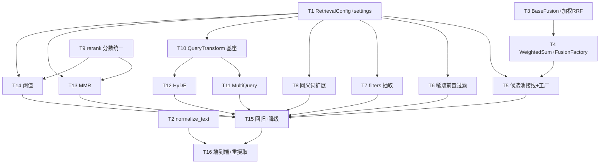

# Implementation Plan

## Overview

本计划实现 Phase D 检索增强（确定性归一化 + filters 解析 + 配置接线 + 加权融合/FusionFactory + 稀疏前置过滤 + rerank 分数统一 + 同义词扩展 + 多查询/HyDE/MMR/阈值四项可选增强），共 16 个任务，每个任务均带单元测试，按依赖顺序推进。

> 落地原则（对齐 DEV_SPEC）：
> - **TDD 优先**：每个任务先写/补单元测试再实现，测试通过即验收。
> - **小步可验收**：每个任务约 1 小时粒度，单独可测、可回滚。
> - **外部依赖可 Mock**：LLM / Embedding / OpenCC / 真实索引在单测中用 Fake/Mock；集成测试再走真实后端。
> - **默认关 = 基线**：所有进阶增强默认关闭，关闭时行为与现状逐项一致（Property 9）。
> - **顺序**：配置/归一化基座 → 融合/过滤/重排修复 → 查询扩展 → 进阶增强（多查询/HyDE/MMR/阈值）→ 回归与端到端。

## 进度跟踪表 (Progress Tracking)

> 状态：`[ ]` 未开始 ｜ `[~]` 进行中 ｜ `[x]` 已完成

| 任务编号 | 任务名称 | 单元测试 | 状态 | 关联 Property |
|---------|---------|---------|------|--------------|
| T1 | RetrievalConfig 字段扩展 + settings.yaml 同步 | ✅ | [x] | 9 |
| T2 | 共享 normalize_text + 接入分词两侧/_normalize | ✅ | [x] | 1, 2 |
| T3 | BaseFusion 抽出 + 加权 RRF | ✅ | [x] | 3, 13 |
| T4 | WeightedSumFusion + FusionFactory | ✅ | [x] | — |
| T5 | HybridSearch 候选池接线 + from_settings 走工厂 | ✅ | [x] | — |
| T6 | 共享 _match_filters + SparseRetriever 前置过滤 | ✅ | [x] | 5 |
| T7 | BaseFilterExtractor + 规则抽取 + QueryProcessor 合并 | ✅ | [x] | 4 |
| T8 | 同义词 OR-扩展（expanded_keywords） | ✅ | [x] | 8 |
| T9 | Reranker head/tail 分数尺度统一 | ✅ | [x] | 6 |
| T10 | QueryTransform 基类 + NoOp + HybridSearch 多列表接线 | ✅ | [x] | 13 |
| T11 | MultiQueryTransform（改写+并发+缓存+降级） | ✅ | [x] | 10, 13 |
| T12 | HyDETransform（假设文档+augment+doc_type 门控+降级） | ✅ | [x] | 10 |
| T13 | MMR 多样性阶段 | ✅ | [x] | 11 |
| T14 | 相关性阈值 / abstain 闸门 | ✅ | [x] | 12 |
| T15 | 向后兼容与降级回归（集成） | ✅ | [x] | 7, 9 |
| T16 | 端到端：NFKC 重摄取 + 多增强串联验证（集成） | ✅ | [ ] | — |

---

## Task Dependency Graph



```json
{
  "waves": [
    { "wave": 1, "tasks": ["1", "2", "3", "9"] },
    { "wave": 2, "tasks": ["4", "6", "7", "8", "10"] },
    { "wave": 3, "tasks": ["5", "11", "12", "13", "14"] },
    { "wave": 4, "tasks": ["15"] },
    { "wave": 5, "tasks": ["16"] }
  ]
}
```

---

## Tasks

- [x] 1. RetrievalConfig 字段扩展 + settings.yaml 同步
  - **目标**：为本特性所有开关补齐配置载体，缺省值使行为退化为现状（向后兼容基座）。
  - **修改文件**：`src/core/settings.py`、`config/settings.yaml`、`config/settings.yaml.example`、`tests/unit/test_settings_retrieval.py`
  - **实现**：`RetrievalConfig` 新增 `candidate_multiplier=2`、`rrf_k=60`、`fusion_weights={}`、`enable_nfkc=True`、`normalize_casefold=True`、`normalize_to_simplified=False`、`enable_filter_extraction=False`、`sparse_filter_overfetch=4`、`enable_synonym_expansion=False`、`synonym_source=""`、`query_transform="none"`、`multi_query_count=3`、`query_transform_concurrency=4`、`query_transform_cache=True`、`hyde_augment=True`、`hyde_skip_doc_types=["xlsx"]`、`enable_mmr=False`、`mmr_lambda=0.5`、`min_score_threshold=0.0`；同步两个 yaml 注释说明。
  - **验收标准**：YAML 提供全部字段时正确解析；字段缺省时回退默认且不报错；`_parse_raw` 仅接收已声明键（多余键忽略）。
  - **测试方法**：`pytest -q tests/unit/test_settings_retrieval.py`（全字段/缺省/多余键三类用例）。
  - _Requirements: 3.2, 3.4, 12.4_

- [x] 2. 共享 normalize_text + 接入分词两侧 / _normalize
  - **目标**：把确定性归一化（NFKC + casefold + 可选繁简）放进共享层，保证 BM25 词表对称、稠密侧同 form。
  - **修改文件**：`src/libs/tokenizer/normalize.py`（新增）、`src/libs/tokenizer/jieba_tokenizer.py`、`src/libs/tokenizer/regex_tokenizer.py`、`src/core/query_engine/query_processor.py`、`tests/unit/test_normalize.py`、`tests/unit/test_tokenizer_consistency.py`
  - **实现**：`normalize_text(text, *, casefold=True, to_simplified=False)`：NFKC → casefold → 可选 `_to_simplified`（OpenCC t2s，缺失则 warning 跳过）；tokenizer 在 `tokenize` 入口调用（参数取自 settings），原内部 `lower()` 由 casefold 接管；`QueryProcessor._normalize` 复用同一函数后再折叠空白。
  - **验收标准**：全角/大写/繁体文本经索引侧与查询侧产出**相同** token 序列；`normalize_text` 幂等；OpenCC 缺失时繁简降级、其余归一化照常。
  - **测试方法**：`pytest -q tests/unit/test_normalize.py tests/unit/test_tokenizer_consistency.py`（Property 1 对称性 + Property 2 幂等 + OpenCC 缺失降级）。
  - _Requirements: 1.1, 1.2, 1.3, 1.4, 1.5, 1.6, 1.7_

- [x] 3. BaseFusion 抽出 + 加权 RRF
  - **目标**：抽象融合接口并让 RRF 支持每路权重，保持无权时与现状逐项一致。
  - **修改文件**：`src/core/query_engine/fusion.py`、`tests/unit/test_fusion_weighted.py`
  - **实现**：新增 `BaseFusion(ABC).fuse(...)`；`ReciprocalRankFusion(k, weights=None)` 实现 `fused = Σ weight_i/(k+rank)`，`_weight_for(list_idx)` 缺省 1.0；保留确定性排序（score desc, chunk_id asc）。
  - **验收标准**：`weights=None`/各路相等时输出与现有无权 RRF 逐项一致；不同权重下排序按公式变化；融合对列表顺序无关。
  - **测试方法**：`pytest -q tests/unit/test_fusion_weighted.py`（Property 3 向后兼容 + Property 13 顺序无关 + 加权排序）。
  - _Requirements: 4.2, 4.4, 4.5, 4.6, 4.8_

- [x] 4. WeightedSumFusion + FusionFactory
  - **目标**：补齐 `weighted_sum` 融合与按配置选择融合器的工厂。
  - **修改文件**：`src/core/query_engine/fusion.py`（新增 `WeightedSumFusion`）、`src/core/query_engine/fusion_factory.py`（新增）、`tests/unit/test_fusion_factory.py`
  - **实现**：`WeightedSumFusion(weights)` 对每路分数 min-max 归一化后加权求和；`FusionFactory.create(settings)` 依据 `fusion_algorithm`（`rrf|weighted_sum`）创建，读取 `rrf_k`/`fusion_weights`，未知算法抛 `ValueError`。
  - **验收标准**：`rrf` → 加权 RRF；`weighted_sum` → WeightedSumFusion；未知值抛 `ValueError`；缺省回退 `rrf`。
  - **测试方法**：`pytest -q tests/unit/test_fusion_factory.py`（三分支 + 未知值异常）。
  - _Requirements: 4.1, 4.2, 4.7_

- [x] 5. HybridSearch 候选池接线 + from_settings 走工厂
  - **目标**：修复配置漂移——候选池宽度按 `top_k_dense/sparse`×`candidate_multiplier`，融合走 FusionFactory。
  - **修改文件**：`src/core/query_engine/hybrid_search.py`、`tests/unit/test_hybrid_candidate_wiring.py`
  - **实现**：`__init__` 增加 `top_k_dense/top_k_sparse`；`search` 用 `dense_k=max(top_k,top_k_dense)*multiplier`（稀疏同理）；`from_settings` 用 `FusionFactory.create(settings)`，并从 settings 读 `candidate_multiplier/top_k_dense/top_k_sparse`。
  - **验收标准**：`dense_k/sparse_k` 按配置计算；缺省等价原 `top_k*2`；`from_settings` 据 `fusion_algorithm` 装配正确融合器。
  - **测试方法**：`pytest -q tests/unit/test_hybrid_candidate_wiring.py`（注入 settings 断言候选宽度 + 融合器类型）。
  - _Requirements: 3.1, 3.3, 4.3_

- [x] 6. 共享 _match_filters + SparseRetriever 前置过滤
  - **目标**：让稀疏路支持前置过滤（over-fetch + 解析期过滤），复用统一的 strict/lenient 判定。
  - **修改文件**：`src/core/query_engine/metadata_filter.py`（新增共享 `match_filters`）、`src/core/query_engine/hybrid_search.py`（`_apply_metadata_filters` 改用共享 helper）、`src/core/query_engine/sparse_retriever.py`、`tests/unit/test_sparse_prefilter.py`
  - **实现**：抽出 `match_filters(meta, filters, structured_keys)` 共享 helper；`SparseRetriever.retrieve` 增加 `filters`/`overfetch`，有 filters 时 `fetch_k=top_k*overfetch`，解析期按 `match_filters` 过滤后截断 top_k；`HybridSearch` 把 `filters` 传入稀疏路。
  - **验收标准**：strict（`sheet_name` missing→exclude）/ lenient（generic missing→include）与后置一致；over-fetch 后仍凑足 top_k；无 filters 时行为不变；前置+后置最终命中集等价于仅后置。
  - **测试方法**：`pytest -q tests/unit/test_sparse_prefilter.py`（Property 5：strict/lenient + 命中集等价 + 无 filters 回归）。
  - _Requirements: 5.1, 5.2, 5.3, 5.4, 5.5, 5.6_

- [x] 7. BaseFilterExtractor + 规则抽取 + QueryProcessor 合并
  - **目标**：从查询文本解析结构化约束并入 filters，可插拔、默认关、外部优先。
  - **修改文件**：`src/core/query_engine/filter_extractor.py`（新增）、`src/core/query_engine/query_processor.py`、`tests/unit/test_filter_extractor.py`、`tests/unit/test_query_processor_filters.py`
  - **实现**：`BaseFilterExtractor.extract(query)->dict`（不得抛异常）；`RuleBasedFilterExtractor`（显式 `key:value` + sheet_name/is_table/row 区间规则）；`QueryProcessor` 持有可空 `filter_extractor`，`_parse_filters(filters, query)` 合并：抽取（低优先）⊕ 外部（高优先），丢 None。
  - **验收标准**：抽取命中/未命中正确；外部与抽取冲突时外部优先；抽取器为 None 时与现状一致；抽取内部异常被吞返回 `{}`。
  - **测试方法**：`pytest -q tests/unit/test_filter_extractor.py tests/unit/test_query_processor_filters.py`（Property 4：合并优先级 + 异常吞没 + 默认关回归）。
  - _Requirements: 2.1, 2.2, 2.3, 2.4, 2.5, 2.6, 2.7_

- [x] 8. 同义词 OR-扩展（expanded_keywords）
  - **目标**：把同义词/别名并入 BM25 查询，稠密侧保持单次，默认关。
  - **修改文件**：`src/core/query_engine/query_processor.py`（`ProcessedQuery.expanded_keywords` + `_expand_keywords`）、`src/core/query_engine/hybrid_search.py`（稀疏路传 expanded）、`tests/unit/test_synonym_expansion.py`
  - **实现**：`ProcessedQuery` 新增 `expanded_keywords`；`_expand_keywords(keywords)` 由 `synonym_map` 扩展、去重保序、原词在前；`enable_synonym_expansion` 开启时 `HybridSearch` 把 `expanded_keywords` 传稀疏路，否则传 `keywords`；`synonym_source` 文件缺失降级空表。
  - **验收标准**：`expanded_keywords` 含原词+别名、去重保序、前缀等于 keywords；默认关时稀疏路用原始 keywords；同义词文件缺失 warning 降级。
  - **测试方法**：`pytest -q tests/unit/test_synonym_expansion.py`（Property 8：保序去重 + 默认关回归 + 缺失降级）。
  - _Requirements: 7.1, 7.2, 7.3, 7.4, 7.5_

- [x] 9. Reranker head/tail 分数尺度统一
  - **目标**：消除精排段（cross-encoder）与未精排段（RRF）分数尺度混用，确立整列单调契约。
  - **修改文件**：`src/core/query_engine/reranker.py`、`tests/unit/test_reranker_scores.py`
  - **实现**：新增 `_unify_scores(head, tail, eps)`：tail 分数单调压缩到 head 最小分之下，原始分写入 `metadata["raw_score"]`/`metadata["score_source"]`；`rerank` 成功路径合并后调用；保留 `rerank_fallback`/`rerank_backend`。
  - **验收标准**：合并列表 `score` 整列单调不增且 head 在 tail 之前；metadata 保留原始分与来源；fallback/None 路径不受影响。
  - **测试方法**：`pytest -q tests/unit/test_reranker_scores.py`（Property 6：单调性 + metadata + fallback 回归）。
  - _Requirements: 6.1, 6.2, 6.3, 6.4, 6.5_

- [x] 10. QueryTransform 基类 + NoOp + HybridSearch 多列表接线
  - **目标**：建立稠密侧查询变换的可插拔基座，并让 HybridSearch 支持多条稠密列表进融合。
  - **修改文件**：`src/core/query_engine/query_transform.py`（新增 `TransformedQuery`/`BaseQueryTransform`/`NoOpTransform`）、`src/core/query_engine/query_transform_factory.py`（新增）、`src/core/query_engine/hybrid_search.py`、`tests/unit/test_query_transform_base.py`、`tests/unit/test_hybrid_multilist.py`
  - **实现**：`TransformedQuery(dense_queries, used_llm, degraded)`；`NoOpTransform` 返回 `[query]`；工厂按 `query_transform` 选择（`none` 默认）；`HybridSearch.search` 对 `dense_queries` 每条各跑一次稠密、得多条列表，连同稀疏列表交 `fuse([*dense_lists, sparse])`。
  - **验收标准**：默认 `none` → 单条稠密列表、行为与现状一致；多条 dense_queries 时产出多列表且融合结果与单列表基线在 N=1 时一致。
  - **测试方法**：`pytest -q tests/unit/test_query_transform_base.py tests/unit/test_hybrid_multilist.py`（Property 13：N=1 等价基线 + 多列表融合）。
  - _Requirements: 8.1, 8.6, 12.1_

- [x] 11. MultiQueryTransform（改写 + 并发 + 缓存 + 降级）
  - **目标**：实现多查询变体改写策略，控制成本并对失败降级。
  - **修改文件**：`src/core/query_engine/query_transform.py`（新增 `MultiQueryTransform`）、`config/prompts/query_rewrite.txt`（新增）、`tests/unit/test_multi_query.py`
  - **实现**：`MultiQueryTransform(llm, n, max_concurrency, cache)`：LLM 改写出 ≤`multi_query_count` 个变体，原 query 始终在列、去重保序；并发上限限制 embedding 调用；`query→变体` 缓存命中不重复调用；异常时返回 `[query]` + `degraded=True`。
  - **验收标准**：fake LLM 固定变体时原 query 在列且去重；缓存命中不再调用 LLM；LLM 抛异常降级单查询且 `degraded=True`。
  - **测试方法**：`pytest -q tests/unit/test_multi_query.py`（Property 10 降级 + 缓存命中 + 去重保序，全部用 fake LLM）。
  - _Requirements: 8.2, 8.3, 8.4, 8.5_

- [x] 12. HyDETransform（假设文档 + augment + doc_type 门控 + 降级）
  - **目标**：实现 HyDE 策略，按 doc_type 门控避免结构化数据幻觉，失败降级。
  - **修改文件**：`src/core/query_engine/query_transform.py`（新增 `HyDETransform`）、`config/prompts/hyde.txt`（新增）、`tests/unit/test_hyde.py`
  - **实现**：`HyDETransform(llm, augment, skip_doc_types)`：LLM 生成假设文档；`augment=True` → `[query, hypo]`，否则 `[hypo]`；目标 doc_type 命中 `skip_doc_types` → 退化 `[query]`；异常 → `[query]` + `degraded=True`；复用 `LLMFactory`。
  - **验收标准**：augment 两态正确；`hyde_skip_doc_types` 命中时跳过；LLM 失败降级单查询；不引入新 LLM 依赖。
  - **测试方法**：`pytest -q tests/unit/test_hyde.py`（Property 10：augment/replace + doc_type 门控 + 失败降级，fake LLM）。
  - _Requirements: 9.1, 9.2, 9.3, 9.4, 9.5_

- [x] 13. MMR 多样性阶段
  - **目标**：在 rerank 后、裁剪前做可选多样性重排，缓解同字/同表冗余。
  - **修改文件**：`src/core/query_engine/diversity.py`（新增 `mmr_rerank`）、`src/core/query_engine/hybrid_search.py` 或查询编排末端接线、`tests/unit/test_mmr.py`
  - **实现**：`mmr_rerank(results, query_vector, embed_fn, lambda_, top_k)`：按 `λ·rel-(1-λ)·max_redundancy` 选择；复用候选稠密向量，缺失则 `embed_fn` 补算或 warning 跳过；`enable_mmr` 关闭时恒等；`λ>=1.0` 等价无 MMR；`_cos` 用 numpy。
  - **验收标准**：含冗余候选时多样性生效；`λ=1` 输出等于输入；`enable_mmr=false` 不改顺序；向量缺失降级原序。
  - **测试方法**：`pytest -q tests/unit/test_mmr.py`（Property 11：λ=1 恒等 + 冗余抑制 + 缺向量降级）。
  - _Requirements: 10.1, 10.2, 10.3, 10.4, 10.5_

- [x] 14. 相关性阈值 / abstain 闸门
  - **目标**：流水线末端可选阈值闸门，整体相关性不足时返回空（abstain）。
  - **修改文件**：`src/core/query_engine/threshold.py`（新增 `apply_threshold`）、`scripts/query.py` 与 `src/mcp_server/tools/query_knowledge_hub.py`（末端接线）、`tests/unit/test_threshold.py`
  - **实现**：`apply_threshold(results, threshold)`：`threshold<=0` 原样返回；否则 Top1 分数 `<threshold` 返回 `[]`；MCP 工具据空结果输出"知识库未覆盖"。依赖 T9 统一分数尺度。
  - **验收标准**：Top1≥阈值原样返回；<阈值返回空；阈值≤0 不介入；MCP 空结果语义正确。
  - **测试方法**：`pytest -q tests/unit/test_threshold.py`（Property 12：阈值语义三态 + 默认关回归）。
  - _Requirements: 11.1, 11.2, 11.3, 11.4, 11.5_

- [x] 15. 向后兼容与降级回归（集成）
  - **目标**：固化"全关=基线"与"单路失败降级"，防止新能力默认态改变现状。
  - **修改文件**：`tests/integration/test_retrieval_backward_compat.py`、`tests/integration/test_retrieval_degradation.py`
  - **实现**：构造默认 settings（所有 enable_* 关、`query_transform=none`、阈值 0），对一组查询断言输出与基线一致；分别注入抛异常的稠密/稀疏路断言降级到另一路；注入失败 QueryTransform 断言降级单查询。
  - **验收标准**：默认配置下结果与 #1–#7 基线逐项一致；任一检索路异常时仍返回另一路；strict/lenient 过滤策略不变。
  - **测试方法**：`pytest -q tests/integration/test_retrieval_backward_compat.py tests/integration/test_retrieval_degradation.py`（Property 7 降级 + Property 9 全关=基线）。
  - _Requirements: 12.1, 12.2, 12.3, 12.5_

- [ ] 16. 端到端：NFKC 重摄取 + 多增强串联验证（集成）
  - **目标**：验证启用归一化后的重摄取与各增强在真实链路串联可用。
  - **修改文件**：`tests/integration/test_retrieval_enhancements_e2e.py`、`tests/fixtures/`（含全角/繁体样例）
  - **实现**：用启用 NFKC 的分词层重跑摄取重建 BM25；跑加权融合 + 稀疏前置过滤 + 同义词扩展 + （开启）multi_query/MMR/阈值，断言 trace 各阶段计数合理、降级路径可用；含一组归一化前后 BM25 命中率回归对比。
  - **验收标准**：重摄取后查询词形与索引对齐、命中不退化；各增强开启时端到端无异常；关闭时回归基线。
  - **测试方法**：`pytest -q tests/integration/test_retrieval_enhancements_e2e.py`（真实样例 + 重摄取 + verbose 阶段断言）。
  - _Requirements: 1.8, 12.1_

---

## Notes

- **归一化迁移（T2/T16）**：启用 NFKC/casefold/繁简后 BM25 词表改变，**既有 BM25 索引需重建**（重新摄取语料），在 T16 端到端前完成重摄。稠密向量（Chroma）无需重建。
- **可选外部依赖**：繁简归一需 `OpenCC`（T2），多查询/HyDE 需 LLM（T11/T12，复用 `LLMFactory`），MMR 余弦需 `numpy`（T13，确认是否已传递引入）。缺失时各自降级，不阻断查询。
- **两层默认关**：T7/T8/T11/T12/T13/T14 默认关闭；T15 专门回归"全关=基线"。
- **分数尺度依赖**：T14 阈值依赖 T9 的统一分数尺度才有可比基准；阈值具体取值校准延后到评估阶段（Phase H）。
- **MCP schema 保持精简**：新开关均走 `settings.yaml`，不进 `query_knowledge_hub` 的 INPUT_SCHEMA（仅 `collection`/可选 `filters`）。
- **范围之外**：评估 harness、Dashboard、chunking 改造，以及比 §7/§8 更重的迭代式查询改写、近重复语义聚类去重，均不在本轮。
