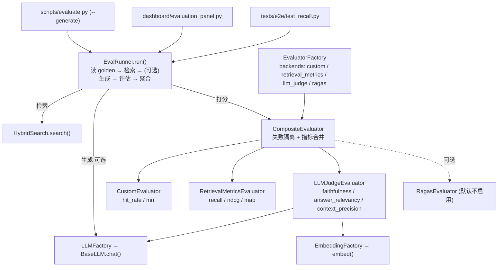

# 设计文档：Phase H 评估体系（phase-h-evaluation-system）

> 说明：本文档为**设计 + 实施回溯（design-first / 已实现）**。Phase H 代码已全部落地并合入 `main`（合并提交 `6d37bcf`，特性分支 `feat/phase-h-llm-judge-eval`）。这里记录"我们做了什么、为什么这么做、每一步的结论与数据"。requirements/tasks 不另列（DEV_SPEC.md「阶段 H」状态表 H1–H10 已回填）。

## Overview

Phase H 的目标是给已搭好的 RAG 检索系统装上一把**可量化、可重复、可回归的"尺子"**：把"检索/回答得好不好"从主观感受变成数字，从而能用数据驱动决策（例如 Phase D 那批默认关闭的检索增强开关到底该不该开）。

阶段产出分三层：

1. **可插拔评估器体系**：统一接口 + 多种后端（检索指标 / LLM 裁判）+ 组合器 + 工厂，配置驱动。
2. **评估运行装置**：EvalRunner（含"生成"步骤）+ 真实 golden set + CLI + Dashboard 面板 + E2E 回归。
3. **用评估做决策**：重排修复、弃答阈值校准、Phase D 全开关 A/B，并把有数据支撑的结论回写默认配置与 DEV_SPEC。

### 一个关键架构前提：本系统是"检索增强"服务，生成在客户端

主产品链路（MCP `query_knowledge_hub` → `HybridSearch` → `Reranker` → `ResponseBuilder`）**只做到检索**：`ResponseBuilder` 把检索块拼成带引用的 Markdown，**不调用 LLM 生成答案**。RAG 中的 "G(Generation)" 由消费方的 LLM（Claude/Copilot 等 MCP 宿主）完成。

直接后果：**评估"生成质量"时没有现成答案可评**。因此 `EvalRunner` 内部自带一个"生成步骤"（检索 → 取上下文 → 调 LLM 生成答案 → 交给裁判打分）。这是全项目唯一"为回答问题而生成"的地方，且**仅用于评估**，不代表产品会返回生成答案。

### 能力与对应代码

| # | 能力 | 主要文件 | 性质 |
|---|------|---------|------|
| H1 | RagasEvaluator（可选后端） | `src/observability/evaluation/ragas_evaluator.py` | 已实现，因依赖冲突改由 H7 落地，保留为可选 |
| H2 | CompositeEvaluator | `src/observability/evaluation/composite_evaluator.py` | 组合多评估器、失败隔离、指标合并 |
| H3 | EvalRunner + Golden Set + CLI | `eval_runner.py` / `scripts/evaluate.py` / `tests/fixtures/golden_*.json` | 评估总装线 |
| H4 | 评估面板 | `src/observability/dashboard/pages/evaluation_panel.py` | 运行评估 + 看指标 + 看生成答案 |
| H5 | Recall 回归（E2E） | `tests/e2e/test_recall.py` | 确定性回归阈值 |
| H6 | RetrievalMetricsEvaluator | `src/libs/evaluator/retrieval_metrics_evaluator.py` | recall@k / ndcg@k / map@k |
| H7 | LLMJudgeEvaluator | `src/libs/evaluator/llm_judge_evaluator.py` | LLM-as-judge 生成指标 |
| H8 | EvalRunner 生成链 | `eval_runner.py` / `scripts/evaluate.py --generate` | 补齐生成步骤 |
| H9 | 重排多语言修复 + 阈值校准 | `cross_encoder_reranker.py` / `config/settings.yaml` | 修中文重排 + 校准弃答门 |
| H10 | Phase D 开关 A/B | `config/settings.yaml(.example)` + 本地脚本 | 数据驱动默认值 |

## Architecture



设计要点：
- **面向接口**：`BaseEvaluator.evaluate(query, retrieved_ids, golden_ids, generated_answer, ground_truth, contexts) -> dict[str,float]`。上层只认接口，换/加评估器零改动。
- **配置驱动**：`settings.evaluation.backends` 列表 → 工厂逐个造 → Composite 包成一个。
- **组合模式**：CompositeEvaluator 本身也是 BaseEvaluator，对 EvalRunner 透明。
- **依赖注入**：EvalRunner / LLMJudge 的 hybrid / llm / embedding 均可注入，便于桩测。

### 数据流（一次 golden 评估）

```
golden_*.json
  └─ EvalRunner.run() 逐条 case
       ├─ HybridSearch.search(query)         → retrieved_ids + contexts(块正文)
       ├─ (若 --generate) LLM.chat(prompt)   → generated_answer
       ├─ CompositeEvaluator.evaluate(...)   → 合并各后端指标
       └─ 聚合：每指标分别计数；不可答 case 仅计 faithfulness
  → EvalReport(num_cases, aggregate_metrics, per_query[])  → CLI/面板/JSON
```

## Components and Interfaces

### BaseEvaluator（统一契约）
抽象方法 `evaluate(...)` 返回 `{指标名: 分数}`。Phase H 在原签名上**新增 `contexts: list[str] | None`**（检索块正文，按排名序），供生成质量指标判定"答案 vs 上下文"。所有实现同步透传。

### CustomEvaluator —— hit_rate / mrr（首命中视角，零依赖）
- **hit_rate**：top-k 命中任一 golden 即 1.0，否则 0.0。
- **mrr**：首个命中的倒数排名（排 1=1.0，排 3=0.33）。
- 局限：只看首命中，看不出召回完整性与首名之后排序 → 由 H6 补足。

### RetrievalMetricsEvaluator —— recall@k / ndcg@k / map@k（排序/完整性，零依赖）
- **recall@k** = |相关 ∩ top-k| / |相关|。
- **ndcg@k**：`DCG = Σ rel_i / log2(rank+1)`，除以理想 IDCG 归一到 0~1。
- **map@k（AP）**：`AP = Σ_i (Precision@i · rel_i) / |相关|`，奖励相关块靠前。
- 空 golden（不可答）返回全 0，并由 EvalRunner 聚合排除。

### LLMJudgeEvaluator —— 生成质量（LLM 当裁判，复用项目 LLM 客户端）
不依赖 ragas/langchain，直接用 `LLMFactory` 的 `BaseLLM.chat()`（已对接自建端点）+ `EmbeddingFactory`：
- **faithfulness（防幻觉）**：LLM 拆原子主张，逐条判"仅凭上下文可推得？"，`score=支撑/总数`；正确拒答→1.0；空答案/无上下文→0.0。
- **answer_relevancy（防跑题）**：LLM 反推 N 个问题，与原问题做 embedding 余弦相似度均值；无 embedding 时降级 LLM 直接打分；拒答→0.0。
- **context_precision（上下文精排）**：逐块判有用性 → Average Precision 排名加权。
- 工程化：每指标尽量 1 次（批量）LLM 调用；强制 JSON + 容错解析；异常安全降级为 0。

### RagasEvaluator（可选后端，默认不启用）
封装 ragas 三指标，含 lazy import + 清晰 ImportError + 可注入 `score_fn`。**未采用原因**：环境内 ragas 0.4.x 与 langchain 1.x 不兼容（`langchain_community.chat_models.vertexai` 导入失败），新 API 与本仓适配不匹配，还需把裁判 LLM 接自建端点。综合成本/稳定性改走 H7；ragas 留作 `backends` 可选项。

### CompositeEvaluator（组合器）
- 逐个调用、合并 metrics。
- **失败隔离**：单个抛异常 → 记 warning、记空、不影响其他。
- **按需命名空间**：指标名冲突用 `{evaluator}.{metric}`，不冲突保持扁平。
- `from_settings` 读 `evaluation.backends`，空则默认 `["custom"]`。

### EvalRunner（评估总装线 + 生成链）
- `run()`：逐条 case → 检索（取 `retrieved_ids` 与 `contexts=块正文`）→ 若注入 llm 则 `_generate` → `evaluator.evaluate(...)` → 收集 → 聚合。
- `_generate`：用"只依据资料、无信息则明确说无法回答"的 prompt 调 `BaseLLM.chat()`。
- `from_settings(..., generate=True)` 一行构建真实 HybridSearch + 组合评估器（+ 生成 LLM）。

### CLI / 面板 / 回归
- `scripts/evaluate.py`：`--test-set / --top-k / --config / --generate / --json`。不加 `--generate` 仅评检索（不调 LLM）。
- `evaluation_panel.py`：路径/Top-K/「运行生成」开关；展示分行指标 + 每条生成答案与不可答标记。Streamlit 同步阻塞，大集合建议 CLI。
- `tests/e2e/test_recall.py`：确定性假检索器 `ControlledHybrid`，固定阈值 hit_rate≥0.8、mrr≥0.6，回归"评估流水线本身"。

## Data Models

### golden set schema（`golden_rail.json` / `golden_rail_hard.json`）
```json
{
  "collection": "rail",
  "test_cases": [
    {
      "id": "Q01",
      "query": "...",
      "expected_chunk_ids": ["md_..._0000_..."],
      "ground_truth": "标准答案文本",
      "answerable": true,
      "difficulty_tags": ["synonym"]
    }
  ]
}
```
- `expected_chunk_ids`：检索指标的"标准答案块"；不可答题为空 `[]`。
- `ground_truth`：生成质量指标（context_precision 的参考、对照）所需。
- `answerable`：聚合口径开关（不可答仅计 faithfulness）。
- `difficulty_tags`（仅困难子集）：A/B 归因标签。

### EvalReport / QueryResult（`eval_runner.py`）
- `QueryResult`：`query / retrieved_ids / expected_ids / metrics / generated_answer / answerable`。
- `EvalReport`：`num_cases / aggregate_metrics / per_query[]`；均带 `to_dict()` 供 CLI `--json` 与面板渲染。

### chunk_id 格式
`md_{doc_hash[:12]}_{index:04d}_{text_hash}` —— 由文件内容 + 切分配置确定性生成（同语料同配置重摄取得到相同 id）。

## Correctness Properties

### Property 1: 聚合口径
每个指标分别计数求均值；**不可答 case 仅计 faithfulness**（`_UNANSWERABLE_METRICS`），不计 hit_rate/mrr/recall/ndcg/map/answer_relevancy/context_precision —— 否则正确拒答的 0 分会错误拉低均值。

### Property 2: faithfulness 拒答语义
正确拒答（"无法回答"等）无事实主张 → 视为忠实 1.0（用于检验"不可答题是否零幻觉"）。

### Property 3: 弃答阈值可分性
在 `golden_rail` 上，重排 Top1 分可答（min 0.9974）与不可答（max 0.9111）无重叠，阈值 0.95 实现 15/15 正确分类。

### Property 4: 检索指标饱和性
40 块小库下 recall@10 近乎恒为 1.0，区分度落在 mrr/ndcg；A/B 结论据此解读。

### Property 5: chunk_id 确定性
同语料 + 同切分配置重摄取得到相同 chunk_id，故 golden set 的 `expected_chunk_ids` 在重建索引后仍可复现。

## Error Handling

- **评估器失败隔离**：CompositeEvaluator 捕获单个 evaluator 异常，记 warning 并以空结果继续（ragas 超时不拖垮 hit_rate）。
- **LLM/JSON 容错**：LLMJudge 的 `_ask_json` 去代码围栏、抓最外层 `{}`；LLM 调用异常或解析失败 → 该指标降级为 0，不崩溃。
- **重排降级（显式）**：cross-encoder 模型加载失败（缺包/无网络/未缓存）→ 退回 overlap stub 并打 **WARNING**（修复了原先静默降级、中文重排恒≈0 的隐患）。
- **golden 文件缺失**：`evaluate.py` 返回退出码 1 并打印友好错误，不抛栈。
- **OpenCC 缺失**：`normalize_to_simplified` 优雅降级为 no-op。

## Testing Strategy

- **单元（桩，不联网）**：`test_retrieval_metrics_evaluator.py`（已知值/k 截断/边界）、`test_llm_judge_evaluator.py`（三指标 + 拒答 + JSON 容错 + 异常隔离 + helpers，ScriptedLLM/StubEmbedding）、`test_composite_evaluator.py`（合并/命名空间/失败隔离）、`test_cross_encoder_reranker.py`（确定性强制 fallback，不依赖网络）。
- **E2E**：`test_recall.py` 用确定性假检索器固定阈值回归评估流水线。
- **实跑验证**：真实 `golden_rail.json` 跑 `--generate`，单题桩测先验证指标数学，再全量真调 LLM。
- 全量 `tests/unit` 评估相关全绿（947 passed 时点）。

## 实施过程与结论数据（按时间顺序）

### 步骤 1：建真实 golden set + 清理答案泄漏
- 摄取高铁语料（10 篇 .md）→ collection `rail`，每篇 4 块共 40 块；查询 ~1s（摄取慢源于每块 LLM 元数据增强，与检索无关）。
- **修复污染**：`qa_checklist.md`（含全部答案）被一并摄取（7 块）。注意 `DocumentManager.delete_document` 删 BM25 按 source_path 传参而 BM25 实际按 chunk_id 删（删不净），故用一次性脚本**先查 chroma 取 7 个真实 chunk_id → chroma 删 + 逐个 bm25 删 + save** 精确清除。
- 建 `golden_rail.json`（15 题，expected_chunk_ids 由答案独特关键词全文定位；Q13–Q15 不可答）。

### 步骤 2：补 EvalRunner 生成链（核心缺口）
- 原 EvalRunner 只检索、无 answer/contexts → 生成指标无从算。补：取 `r.text` 作 contexts、调 LLM 生成、把 answer/contexts/ground_truth 传给评估器。
- 单题延迟：生成 ~6s、裁判 ~49s（3 LLM + N embedding）。

### 步骤 3：LLM 裁判（路线 B）+ 全量结果
对 `golden_rail.json` 15 题真实跑通（~14 分钟，后台）。**最终聚合（修正口径后）：**

| 指标 | 值 |
|---|---|
| hit_rate | 1.0（12 可答） |
| mrr | 0.9583（仅 Q03 排第 2） |
| recall | 1.0 |
| ndcg | 0.9692 |
| map | 0.9583 |
| faithfulness | 1.0（全 15，含 3 拒答） |
| answer_relevancy | 0.8828（12 可答） |
| context_precision | 0.9757（12 可答） |

**定性**：3 个不可答题全部正确"无法回答"，零幻觉。

### 步骤 4：聚合口径修正
最初把不可答的 answer_relevancy=0、context_precision=0 也计入，错误拉低（0.706 / 0.781）。改为**不可答仅计 faithfulness** 后为 0.883 / 0.976。聚合抽成 `_aggregate(per_query)`，对已存 per_query **零成本重算**（不调 LLM）。

### 步骤 5：检索排序指标（H6）+ 面板接线 + 单测
- 新增 RetrievalMetricsEvaluator，离线对已存 retrieved_ids 重算入报告。印证：Q02/Q09 各 2 个正确块且都召回（hit_rate/mrr 看不出"找全",recall 能）。
- 面板加「运行生成」开关、显示生成答案与不可答标记、指标分行。
- 补两套桩单测（不联网）。

### 步骤 6：重排多语言修复（H9）
- **根因**：`sentence-transformers` 未装时 cross-encoder 静默退回"英文按空格分词"stub，中文无空格 → 重排分恒≈0 → 重排对中文等于没开。
- 修复：模型换 `BAAI/bge-reranker-base`（多语言；经 `HF_ENDPOINT=https://hf-mirror.com` 镜像下载、缓存后离线可用）；工厂 `except ImportError` 放宽为 `except Exception` + 显式 WARNING；单测确定性化。修复后相关 ~0.999 / 无关 ~0。

### 步骤 7：弃答阈值校准（H9）
弃答门卡**重排后 Top1 分**。修好重排后对 `golden_rail` 收集：

| 组 | Top1 |
|---|---|
| 可答 Q01–12 | min 0.9974，均值 0.9989 |
| 不可答 Q13/Q14 | 0.18 / 0.24 |
| 不可答 Q15 | 0.9111（近似命中） |

无重叠 → `min_score_threshold = 0.95`，验证 15/15 正确。写入本地 settings.yaml；example 保持 0.0 + 说明。
> RRF 融合分按排名算、与绝对相关度无关，不适合做弃答信号。

### 步骤 8：Phase D 开关 A/B（H10）
现有 golden 检索饱和，构造困难子集 `golden_rail_hard.json`（30 题，难度全来自问法，按 `difficulty_tags` 归因，语料不变）。

**归一化 / MMR（无 LLM）：**

| 开关 | 标签 | n | 关 | 开 | 结论 |
|---|---|---|---|---|---|
| normalize_casefold | casefold | 4 | 1.0/1.0/0.98 | 1.0/1.0/0.98 | 无差异 |
| enable_nfkc | fullwidth | 3 | 1.0/1.0/1.0 | 1.0/1.0/1.0 | 无差异 |
| normalize_to_simplified | traditional | 4 | 1.0/0.775/0.822 | 1.0/0.875/0.908 | **有提升** ✅ |
| enable_mmr | multi_hop | 3 | 1.0/1.0/0.973 | 1.0/1.0/0.973 | 无差异 |

casefold/nfkc 无差异因 dense 对大小写/全半角鲁棒 + recall 饱和；其价值在 BM25 稀疏侧，需隔离 sparse + hit@1 才测得出。

**synonym（词级扩展 + 通用词表 60+ 条）：** A/B（n=7）开/关相同（1.0/0.9048/0.9286），零效果。覆盖检查 7 题仅 3 题命中无关 key。结构性结论：词级扩展解决"换标准术语",这批是"描述性意译" → 属 query_transform 范畴。

**query_transform（需 LLM）：**

| 子集 | none | multi_query | hyde |
|---|---|---|---|
| paraphrase_vague (5) mrr/ndcg | 0.725/0.789 | **0.900/0.926** | 0.767/0.826 |
| synonym (7) mrr/ndcg | 0.905/0.929 | **1.000/1.000** | 0.905/0.929 |

multi_query 明显改善口语/意译题排名（补上词表补不了的部分）；hyde 本语料无收益。recall 全程 1.0。

## 决策与默认值变更

| 开关/项 | 决策 | 依据 | 落点 |
|---|---|---|---|
| `normalize_to_simplified` | `false → true` | 繁体查询排名提升、无副作用、OpenCC 缺失降级 | settings.yaml(.example) |
| `min_score_threshold` | 本地设 `0.95` | 重排 Top1 校准 15/15 | 本地 0.95；example 0.0 + 说明 |
| `rerank.model` | 换 `BAAI/bge-reranker-base` | 修中文重排 | settings.yaml(.example) |
| `normalize_casefold`/`enable_nfkc`/`enable_mmr` | 保持现状 | 当前语料无可测收益 | 不变 |
| `enable_synonym_expansion` | 保持默认关 | 对意译无效（属 query_transform） | 不变 |
| `query_transform` | 默认 `none` + 启用建议 | multi_query 有效但每查询有 LLM 成本 | 文档建议 |
| `evaluation.backends` | `custom + retrieval_metrics + llm_judge` | H6/H7 | settings.yaml(.example) |

**原则**：免费且有据 → 直接改默认；带成本（multi_query）→ 给建议不强制；校准值（threshold）绑私有语料 → 只进本地、example 给方法不给值。

## 范围外 / 未来工作 / 遗留项

- **Ragas 真正接入**：待版本理顺 + 端点适配后，可与 llm_judge 交叉验证。
- **casefold/nfkc 稀疏侧验证**：需 BM25 单路 + hit@1 + 针对性查询。
- **synonym 真实价值**：需"换标准术语"型查询 + 方向正确（查询词→语料词）的词表。
- **multi_query 默认化**：面向口语查询为主且接受成本时可考虑。
- **更大/非饱和语料**：当前 40 块小库使指标饱和，A/B 区分度受限。
- **本地资产（不入库）**：高铁语料、`golden_rail*.json`、`synonyms_rail.json`、A/B 脚本、`tmp_summary_note/` 绑私有语料/敏感配置，仅评估代码与默认配置入库。

## 复现实验

- 摄取：`PYTHONPATH=. .venv/bin/python scripts/ingest.py --path <语料目录> --collection rail`
- 评估（仅检索）：`scripts/evaluate.py --test-set <golden>.json --top-k 10`
- 评估（含生成质量）：追加 `--generate`（需 LLM）
- 重排/校准需可达模型：`HF_ENDPOINT=https://hf-mirror.com`（首次下载 `BAAI/bge-reranker-base`）
- 单测：`PYTHONPATH=. .venv/bin/python -m pytest -q tests/unit`
